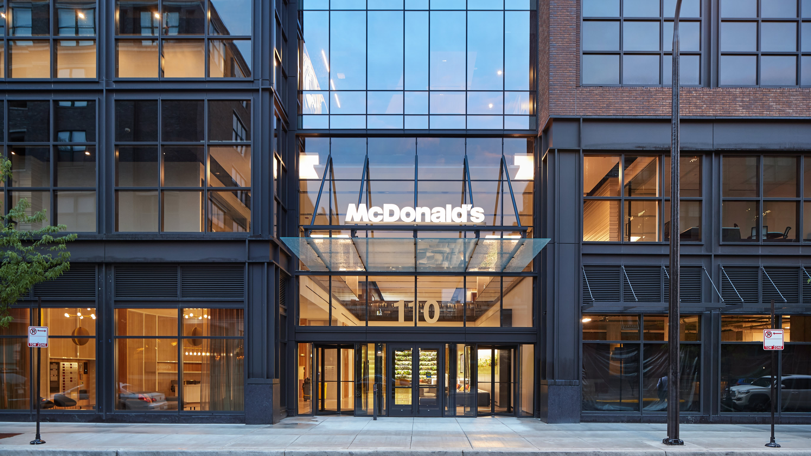
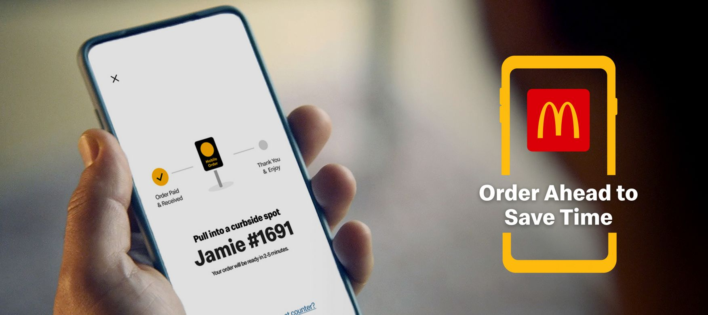
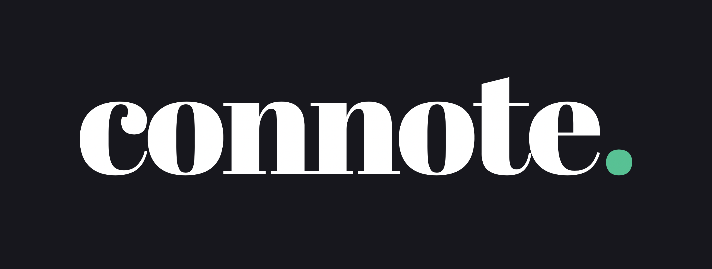
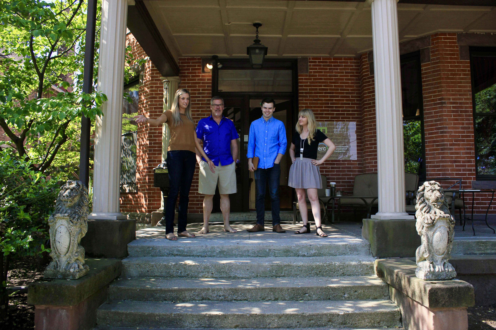
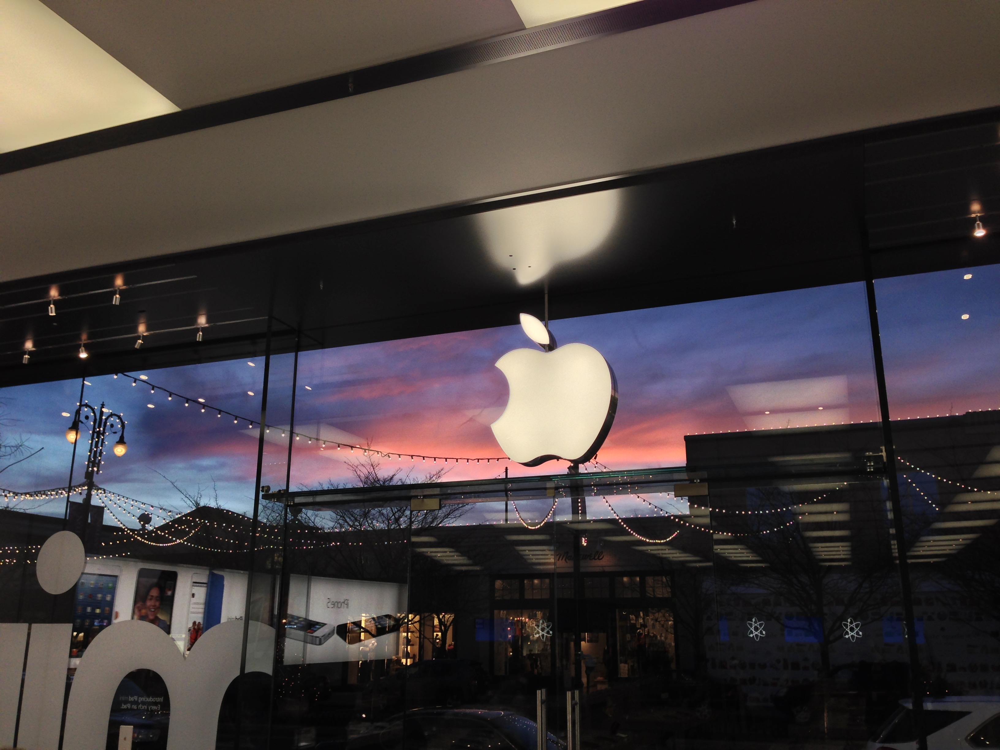
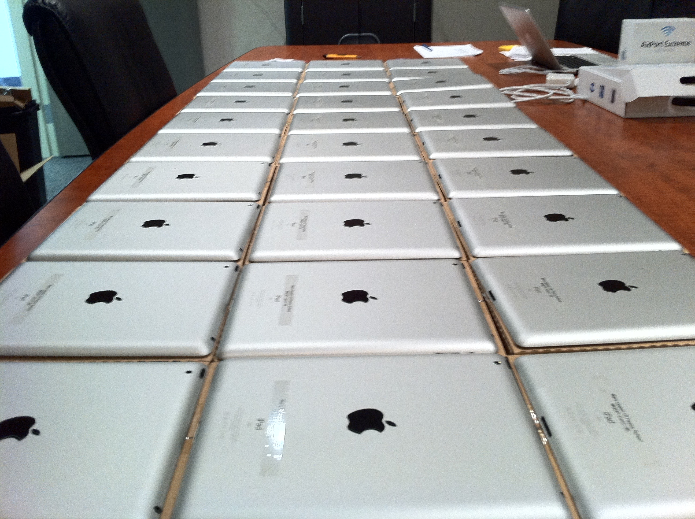

---
tags:
  - meta
title: Résumé
layout: page
permalink: /resume
aliases:
  - /resume
---

# Work history

This is a collection of roles, projects, and experiences that have contributed to my professional history. I’ll be keeping this page updated with links to related projects or apps from these roles and companies, or other notes, pictures, and anecdotes.

## McDonald’s

Leader in the Global Technology organization at the corporate headquarters in Chicago.

### Senior Director, Global Digital Products & Platforms
<time>October 2022–present</time>

In this role within the Global Customer Tech organization, I lead the engineering and technical teams of the Ordering group. This group includes global mobile ordering, web ordering, self-ordering kiosks, digital payments, integrated McDelivery, the third-party ordering marketplace platform, automated drive-thru order-taking, commercial platforms for menu and nutrition data, and cloud infrastructure platforms for scale and speed.  
  
Our customer-facing products and commerce platforms support more than 75 global markets, serve over 150 million registered users, and generate $20 billion in annual system-wide sales. My team supports key focus areas for the company’s digital growth—including the top priorities of digital, delivery, and drive-thru—and works to extend McDonald’s continuing industry leadership as the #1 food app in the world.

- [Ready on arrival](https://corporate.mcdonalds.com/corpmcd/our-stories/article/mcd-announces-targets-development-loyalty-membership-cloud-tech.html)
- [McDelivery](https://corporate.mcdonalds.com/corpmcd/our-stories/article/mcd-announces-targets-development-loyalty-membership-cloud-tech.html)
- More projects to be added soon.

### Director, Global Digital Platforms
<time>May 2021–October 2022</time>

Led the engineering teams for customer-facing products and platforms, including the McDonald’s global mobile app, self-ordering kiosks, and global websites. Assembled a high-performing engineering and architecture team focused on globalization, standardization, and establishing a technical platform for scale.

- [Centralized mobile development](/)
- More projects to be added soon.

### Senior Product Manager, Global Mobile App
<time>June 2019–May 2021</time>

In my first position at McDonald’s, I focused on the global mobile app and the rollout of the new MyMcDonald’s loyalty program. I led a cross-functional team of product managers, experience designers, and mobile engineers to define, develop, and deploy the loyalty customer experience now used by hundreds of millions every day.

- [MyMcDonald’s Rewards](https://corporate.mcdonalds.com/corpmcd/our-stories/article/loyalty-rewards.html)

## Punchkick

Mobile-focused research, design, and software development product studio based in Chicago.[^1]

### Principal, Head of Product
<time>May 2017–June 2019</time>

Responsible for pitching and winning new clients and projects, maintaining a portfolio of client accounts while delivering enterprise-level products to millions of customers, and driving strategy initiatives that defined the trajectory of the organization. Led all major new business sales opportunities—including presentation and proposal strategy, technical solution design, and strategic selling—to consistently deliver on an annual sales run rate of $3 million.

- [Berkley One](/berkley)
- [Lightbox](/lightbox)
- [optOn](/opton)
- More projects to be added soon.

### Senior Product Manager
<time>December 2015–May 2017</time>

Generated complex product backlogs for end-user applications and middleware APIs, including fully realized user stories and Gherkin acceptance criteria, and partnered with designers and developers to help bring each feature to life. Acted as a Scrum Certified Product Owner (CSPO) within the Agile-Scrum development team and consulted clients on Agile best practices and transformation.

### Pre-Sales Solution Architect
<time>July 2014–December 2015</time>

Defined and priced solutions for custom iOS and Android applications, web apps, and web services for enterprise-level clients like Allstate, Marriott, and PetSmart. Worked with new business to strategize pitch, and close large and technically complex new projects.

## Connote LLC
<time>2019–present</time>

Freelance copywriting, design, and sales consulting. Took on projects during the pandemic.

- [WolfCo](https://wolfco.us) branding, brand voice & style guide, presentation theme, and website content (2020).
- More projects to be added soon.

## Emerging Marketing

### Creative Technologist
<time>July 2013–July 2014</time>

Business-to-business marketing agency and web development firm in Columbus, Ohio.[^2] Brought on as a copywriter, later gained experience with technical writing, content strategy, search engine optimization, sales proposal preparation, graphic design and branding, web design, frontend web development, and learning about complex B2B industries and organizations.

## Apple

### Genius
<time>August 2011–October 2013</time>

Worked part-time during college at an Apple retail location at Easton Town Center in Columbus, Ohio. First hired as a Specialist on the sales floor, later graduated to a Genius Bar technician and later Mac repair technician, with hands-on training and certification at Apple corporate headquarters in Cupertino.

## G & G, Inc.

### iPad Configuration Technician
<time>2011</time>

Apple equipment supplier for the education market in Cleveland, Ohio. Spent the summer configuring hundreds of iPads for schools using Apple Configurator and the Apple Volume Purchase Program, and later published a configuration guide that automated repetitive tasks for teachers and school administrators.

---

# Education

## The Ohio State University
<time>2013</time>

Received a Bachelor’s degree in English, with a focus on British and American literature and rhetoric, and a minor in Visual Communications Design. Graduated *magna cum laude*. [^3]

[^1]: Acquired by Wipfli LLP in 2020.
[^2]: Rebranded to Attaché in 2015.
[^3]: Transferred from Miami University in 2010.

