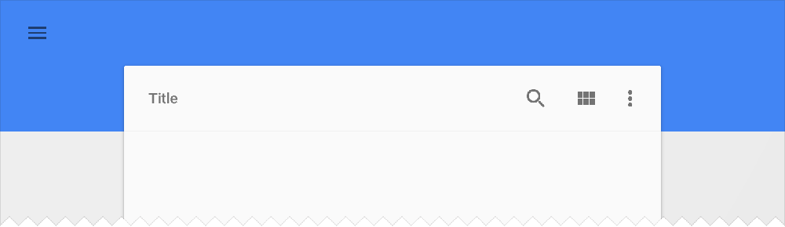

Even before its release in 2008, Android’s only constant has been reinvention. What began as a basic operating system for feature phones has exploded into the top mobile platform on the planet, with the industry’s largest touch screens and most extreme hardware capabilities. Android became a diverse and robust ecosystem of smartphones and tablets, with custom designs and features for each distinct manufacturer. The core of Android remained strong, but its influence was waning: as Google iterated its platform with new features and versions, carriers and OEM partners were sloth to adopt. When Google looked to expand Android onto types of devices—like wearables, televisions, and cars—it came time to pull the reins harder.

Android Lollipop represents Google asserting control of its platform, and its intention to bring its singular vision for Android to every connected device in your life. Welcome to Android everywhere.

- [Material Design wipes the slate clean](#material-design)
- [Google redesigns Android, one app at a time](#redesigns-android)
- [Lollipop makes Google’s case for unity](#lollipop-unity)

## Material Design wipes the slate clean {#material-design}

When Android took the scene on the T-Mobile G1 in 2008, its aesthetic resembled the Google of a bygone era. Software buttons were covered in a gloss and sheen reminiscent of competitors’ devices, icons adopted a strange left-facing orientation, and the OS shipped without an on-screen keyboard, relying on the G1’s slide-out variety instead. Android played nicely with Gmail and allowed for home screen widgets, miniature applications that differentiated the platform immediately from Apple’s locked-down ecosystem. But the operating system was very much in its infancy, and its growth trajectory since has been aggressive. Every future iteration of Android brought features designed to accommodate new types of devices and new carrier partners, with the addition of resolution flexibility in 2.1 Eclair and CDMA network support in 2.2 Froyo. (Android releases, it should be noted, are named after desserts in alphabetical order.) As Android grew to become Apple’s first real competitor on mobile, and as millions of new Android devices were activated every day, Google needed to reshape its platform’s dated image.

The challenge was larger than a new paint job. Because of its openness and willingness to accommodate partners’ priorities, Android as a macroscopic platform had become an inconsistent amalgam of interface ideas and disparate designs. Each Android manufacturer (and, in some cases, each unique handset) boasted interface tweaks or entire skins that diverged from Google’s prescribed designs. This trend was in part because of OEMs’ desire to assert themselves within an increasingly crowded smartphone industry, but also a symptom of Google’s reluctance to wrest control of its platform. With [Android 3.0 Honeycomb](/more-android-than-android#nexus-9), the company took a stand: the tablet-only operating system hinted at Google’s new direction by modernizing the home screen interface and replacing the physical buttons for Back, Home, and Menu with on-screen options. Honeycomb launched with the ill-fated Motorola Xoom, but indicated a fresh direction for the search giant: it was conscious of design, and wasn’t going to leave Android’s destiny entirely in manufacturers’ hands.

In 2011, alongside the launch of its Galaxy Nexus flagship, Google unveiled a quantum leap for design on the Android platform with 4.0 Ice Cream Sandwich. Nearly every nook and cranny was revisited under the leadership of [Matías Duarte](https://www.punchkick.com/tweets/2014/11/11/we-decided-smartphones-werent-for-a-certain-kind-of-person-they-were-for-everyone), the new design lead Google nabbed from his work on the forward-thinking webOS team at Palm. Implementing a design aesthetic called “Holo,” Google revised iconography and menus with logical geometric shapes and flat textures. For years, text on stock Android devices had been set in Google’s custom Droid typeface. In Android 4.0, this changed over to another in-house font, Roboto, which was designed to better take advantage of Android devices’ high-resolution displays. But Google’s work was just beginning: because of the Android platform’s troubles with version fragmentation, brought about by sluggish carrier and manufacturer support for new releases, many Android users would need to wait months or years to enjoy Android 4.0 and its successors. Google could design anything they wanted for the top 1% of Android users, but a healthy remainder would have to suffer through version 2.3 for *years*.

In spring of 2014, Google teased a new realm for Android with [Wear](https://www.punchkick.com/blog/2014/06/27/android-wear-android-tv-and-material-ui-developer-reactions-to-google-io-announcements), a version of the operating system for smart watches. In the next few months, Android Auto and Android TV entered the fold to take the platform in new mobile and immobile directions. Now, Google needed a design approach that not only worked for legacy devices, but also incorporated the modern thinking for its upcoming ecosystem of hardware form factors. It didn’t have to look far: Google Now, the company’s voice-enabled search and preemptive notification service, featured a gorgeous card-based design philosophy and new ultra-thin fonts. Plus, the app was backwards-compatible with Android devices through a download on the Google Play Store. Although Now’s cards went on to infect interfaces on [Android 4.4 KitKat](https://www.punchkick.com/blog/2013/10/28/google-nexus-5-and-android-4-4-kitkat-within-reach), Google learned a valuable strategy: Android devices didn’t need to be running the latest operating system to take advantage of the latest design ideas. If enough of Google’s core system apps could be updated with new designs, users might feel like they’re running a new OS anyway.

As is common in the technology industry, designs began leaking for a next-generation email interface from Google. Identified by stark blue headers, a slide-out navigation menu, and a curious circular compose button, the “inbox” interface was assumed to be the next iteration of Google’s massively popular Gmail webmail product. (It wound up being an early version of the just-released [Google Inbox](https://www.punchkick.com/blog/2014/10/22/google-inbox) app, which reinvents how Gmail manages messages.) Leading up to this summer’s Google I/O, the hype surrounding a sweeping redesign was palpable. And as Matías Duarte took the stage to all-too-briefly introduce the future direction of the company’s interface design efforts, the audience cheered: Duarte outlined a uniform system for interfaces, interactivity, and transitional motion that put Android out ahead of even its steepest competition. On the heels of Apple’s iOS 7 redesign, the new design prescription came with a welcome message of consistency and restraint. Google called it “[Material Design](/material-design),” and the framework is poised to reinvent every facet of Android as a platform.

### Form, meet function

Material Design begins with the addition of “material,” the paper-like layers of interface chrome that populate Android apps. Material exists in three-dimensional space, in functional layers on top of one another. Google outlines the behavior for material within applications in their online design guidelines: material never folds or fades out. It can expand and contract, but cannot pass through other layers of material. Pieces of material have a value defining their placement within a z-axis, meaning developers and designers can determine their stacking and ordering within a particular interface, and the operating system will intelligently apply shadows and depth effects on the fly. Further, Material Design guidelines prescribe a palette of colors and choices for typography, lending Android apps an unprecedented level of consistency and predictability. Now, with a certain degree of customization and personalization, most Android apps will look approximately the same, lowering the barrier to usability for millions of novice users.

Material Design is a comprehensive framework of design elements and philosophies that inform Android application development, both for Google and for third-party developers on the platform. Outlined in an immense [48-page manual](http://www.google.com/design/spec/material-design/introduction.html) on the company’s new [design portal](http://www.google.com/design), Material Design includes recommendations and templates for everything from modal dialogue windows, sliders, buttons, and even new notification types called “snackbars” and “toasts.” [Many designers have highlighted](/material-design) the similarity of Google’s Material Design guidelines to Apple’s Human Interface Guidelines (HIG) for OS X and iOS, which have for years helped Mac and iOS developers design their apps within Apple’s specification. Never before has Google’s design guidance been so informative, deep, and complete. Android application designers have a set of frameworks and initial designs upon which they can base their interfaces, and newcomers to the platform have a new user experience tentpole to cling onto.

But as Steve Jobs would say, “design isn’t what it looks like. Design is how it works.” Material Design introduces a uniform system for motion and animation within all kinds of Android apps, allowing developers to add effects and transitions within a consistent and beautiful templates. Buttons and menu items respond to user interaction with ripples of color, new windows or modals expand out from the initial point of contact, and menus slide in from off-screen in consistent and predictable ways. These visual flourishes seem minor, but the theme of consistency and universality helps not only users better understand how to interact with their favorite Android apps, but also provides guidance to third-party developers in regards to user interface best practices. The attention to detail and comprehensiveness signifies a new approach for Google, which has previously allowed some flexibility and interpretation for Android user interface design. But the strategy has been a long time coming.

> “Project Butter really just smoothed things out, made things a bit faster. Android really needed that at the time. It was a drastic change, and helped Android keep up with iOS in regards to feel and responsiveness.”
> 
> [Nick Achtien](https://github.com/nachtien)

With Android 4.1 Jelly Bean in 2012, Google announced a broad-ranging initiate to improve animation quality and fluidity across the operating system. For years, iOS had earned a reputation for its springy animations and silk-smooth scrolling, while Android had been maligned for its lagging responsiveness. With a series of improvements it called “Project Butter,” Google invested in a number of under-the-hood refinements to enhance Android’s visual and touch performance. Among other things, the company included triple-buffering graphics, locked all drawing to a 16-second refresh time, and significantly overhauled the touch input system. The changes improved Android’s reputation for responsiveness, but the operating system still wasn’t quite there: it lacked some of iOS’s visual flourishes that helped make the software *seem* snappier and more responsive.

> “Really, the reason iOS seems so snappy versus Android is in large part because of the transitions. Things can load in the background during transitions, whereas on Android you just see a loading screen. With Material Design, you have transitions that help the OS seem snappier to users.”
> 
> [Nick Achtien](https://github.com/nachtien)

First among these was transition animations. On iOS, transitions between applications were marked with lengthy and dramatic transition screens, which obscured the loading process from users. Meanwhile on Android, such visual feedback was avoided in preference for more honest loading screens, which served to slow down the user flow and imply operational slowness relative to iOS. In some cases, Android phones that were significantly more powerful *felt* slower versus older iPhones because of these animation tricks. With Material Design, Google is moving to standardize a number of interface animations that will help bridge that gap and help Android match its Cupertino competitor in terms of not only actual speed, but apparent speed, as well.

Material Design injects a new level of fluidity and cohesion to Android applications, which will only serve to improve the product experience for Android’s billion customers. The higher degree of polish and the new focus on interface consistency across various aspects of the operating system will help novices and power users alike better understand and interact with their devices. Whereas Android was once an unwashed alternative to iOS in terms of its inconsistent and laissez-faire approach to interface design, Google has begun tightening the reins on its manufacturing partners and prescribing better, more robust guidelines for Android interaction design. Someday, it won’t just be Google’s apps that boast colorful material-centric designs. Material Design will span every aspect of the operating system, and will grow to become an unshakeable part of Google’s overall mobile brand identity.

## Google redesigns Android, one app at a time {#redesigns-android}

The growth of Android’s market share foothold, at least within the United States, stemmed in part from a fruitful yet complicated partnership between Google, Motorola, and Verizon. Having acquired rights to the name “Droid” from Lucasfilm, the companies developed and aggressively marketed a series of handsets named after the robots of *Star Wars* fame. The Motorola Droid and its successors positioned Android has a powerful yet approachable mobile operating system, and the companies’ marketing fully embraced the powerful and technical nature of Google’s software. But each company began to make compromises. As Verizon asserted its control over within an exclusive contract, the carrier began to define which apps and services shipped with Motorola’s handsets. As the Chicago-based manufacturer built out a larger family of Droid products, Motorola started tweaking the user interface to differentiate its Android smartphones from competitors like HTC and Samsung. As non-Google partners started toying with its open and adaptable operating system, the core Android message became lost among the posturing.

Motorola wasn’t the only manufacturer altering the Android user interface. In addition to Moto Blur—Motorola’s in-house Android skin that added social utilities and a redesigned app launcher—Samsung tweaked Android with its TouchWiz and HTC with its Sense UI. These custom skins added some welcome functionality on top of Android, but typically came at the cost of performance and speed. More importantly to Google, it began losing control of its platform’s strong message. Rather than “Android phones,” these handsets were becoming identified by their manufacturers’ interpretations and modifications before all else. Users reported owning “Droids” or “Galaxies,” not Android phones. Part of the issue came down to marketing messaging, which could be amended. But Google had a larger challenge ahead of it, another fallout from its dependence on carrier and manufacturer partners: fragmentation.

As Apple routinely drove updates to its iOS software to iPhone and iPad users over the air, Android was frequently stuck in neutral. Because carriers and OEM partners could determine for themselves when their phones received Android system updates—or, if they received them at all—many users continued running 2.3 Froyo for years after 4.0 Ice Cream Sandwich became available. Manufacturers worked to update their custom interface skins to be compatible with new Android versions, but this development lead-time often took months or more after Google first unveiled the platform’s next iteration. Fragmentation became a real problem for Android, and severely impacted not only Google’s ability to innovate, but also developers’ ability to feasibly design their apps to run on a majority of Android handsets. Google had lost control of its platform, and was beholden in many ways to its partners to ensure adoption.

To amend this in the short term, Google began releasing its popular Nexus line of smartphones and tablets, built alongside manufacturing partners and designed to run the latest and greatest versions of Android. Nexus phones received over-the-air Android version updates as soon as they became available, and remained completely under Google’s control in terms of capabilities and software compatibility. Nexus devices offered a solution to fragmentation for consumers buying new hardware, and allowed Android fans to take advantage of the shiny new things announced at every Google I/O developer conference. Google even expanded this approach to the Google Play Edition program, which offered manufacturing partners’ flagship devices—like the Samsung Galaxy S5 or HTC One—running “stock Android” at an “unlocked” premium price on the Google Play Store. But Nexus and Google Play Editions weren’t a solution to Android’s fragmentation ills for all Android-kind, and simply represented a proverbial “city on a hill” for OEM partners to aspire to. The wider Android ecosystem remained outside of Google’s direct control, and its users couldn’t take advantage of the platform’s latest features. Thankfully, Google itself had already developed an escape hatch: the Google Play Store.

Through the Google Play Store, Google could push updates to core apps and services without requiring users to first perform system updates. Apps like Gmail, Hangouts, and more could run on older OS versions without incident, allowing Google to push its latest design aesthetic and ideas to as wide a range of customers as possible. When Google began rolling out the first updates for Material Design this fall, even users on 4.4 KitKat and above could take advantage. Google Calendar, Gmail, and Hangouts all saw Material Design updates in the Google Play store weeks before Android 5.0 Lollipop was released, allowing users on older and non-Nexus handsets to adopt the company’s new design philosophy immediately. Unlike Apple and iOS, users didn’t need to upgrade an entire version number just to use a hot new feature in Mail. If Google wanted to remain sole steward of its platform, it needed to reach even the furthest among its flock—and the independent app update strategy allowed Google to infect older phones with its design aesthetic one app at a time, adding Material interfaces to core products without needing a system-wide Lollipop overhaul. In short, it solved for fragmentation: while Android’s user base lagged behind on version updates due to tedious partner holdups, Google could forge ahead into new territory and cast a shadow of designs and features backward to the outdated masses.

### App updates are time travelers

Earlier this fall, Google unveiled an all-new take on its Calendar app for Android. Strongly infused with Material Design ideas and built to better incapsulate various areas of users’ lives, the new Calendar replaced the outmoded Google and stock Android Calendar apps for millions of Android users. But its timing was indicative of a new Google product rollout strategy: it came weeks before public availability of Android 5.0 Lollipop, the operating system update whose design cues it borrowed. And it was designed to run on 4.4 KitKat and previous versions, meaning a huge portion of Android’s install base across a myriad sampling of devices could upgrade immediately. The move was intended to improve the Android calendar management experience for as many users as possible, and worked within Google’s frustratingly fragmented software ecosystem to do it. But Google Calendar wasn’t a one-off example: Google began aggressively expanding its Material Design revamp to a wider selection of core Android apps. And because of its app-centric update strategy, even users running past Android versions would benefit.

In fact, Material Design informed the direction for a brand new initiative from Google’s Gmail team. Having acquired the talent behind a novel take on Gmail management called Sparrow, the company spent years of research and product development on a new approach to Gmail inbox management. Borrowing liberally from inbox triage products like Mailbox on mobile, Google Inbox applies task management philosophies within a Material Design framework. Organizing messages into intelligent “bundles” and allowing users to snooze conversations for later, Inbox builds upon a foundational Google service and reimagines it for Material Design. Expanding and transforming Gmail’s primary feature set, Inbox represents a Material Design remake of Google’s most popular and broad-ranging product. Google knows that design isn’t just what it looks like, and Inbox redefines how email works within a Material Design context. But Google wasn’t replacing the venerable Gmail—it was just getting started.

The longstanding Gmail Android client was next, adopting a red accent color and material elements from the company’s comprehensive guidelines. Most interestingly about Gmail was its surprise inclusion of POP and IMAP support, allowing users to add non-Gmail email accounts to the app and receive their Outlook or Yahoo messages in parallel. This move suggests that the Gmail app is intended to replace Android’s longstanding email client for third-party mail services, and could grow to encompass Exchange and other email server types in coming versions. Google was moving to replace core Android system services—calendar management, email clients, and more—with Google-specific application products like Calendar and Gmail. For many, this approach has been polarizing: whereas previous versions of Android have seen new versions of apps fully open and adaptable to any company’s varying intention, recent incarnations have seen little improvement to those underlying apps in favor of shiny new renditions of Google’s core product family.

> “Google has Gmail, Calendar, Google Camera—all these were core components of the Android operating system—and they’ve turned them into Google-branded apps. They’re turning core components of the OS into ‘apps,’ which can be independently updated.”
> 
> [Nick Achtien](https://github.com/nachtien)

Of course, Android still exists as an operating system that manufacturing partners can iterate and remix. HTC, Samsung, and others have built their own custom interfaces and apps on top of the core Android layer. But Google’s stock offering—the variant of Android that ships with Nexus products and is available from Google’s developer website—is overcome with Google-specific applications. Of course, this approach makes business sense: Android is free, Google services are free, and a wider user base allows Google to show more advertisements and monetize its cloud service creations. Google Chrome is perhaps the quintessential example: the Android browser lives on, largely unaltered since its Holo-style redesign under Ice Cream Sandwich. But Chrome, meanwhile, has been reinvented with Material Design and takes advantage of new Lollipop-specific features, like separating tabs into distinct cards in 5.0’s multitasking views. This strategy is neither good nor bad for Android—rather, it tweaks Android’s perception as an open-source project and solidifies Google’s investment in the platform as a product. Android is perhaps the largest smash-hit in the history mobile industry, and Google is rightfully staking its claim.

### Material everywhere

Material Design isn’t just for the next generation of Gmail or Chrome—it’s intended for every app across platforms to build interfaces that play nicely with their environments. Whether on Android, Chrome OS, or on the web within Chrome, Material Design apps and websites will adopt a consistent style and predictable behavior that spans screens and form factors. But a system with such uniformity might suggest that third-party app designers’ hands are tied, and that future versions of popular Google Play apps will begin looking identical. On the contrary: Material Design not only allows for a wide degree of customization and individuality, but also offers a real opportunity for developers and designers to quickly and efficiently build modern Android apps that reach an unprecedented number of users.

The design prescriptions in Google’s Material Design guidelines are specific, but not constraining enough so as to limit designers’ creativity and stifle brand uniqueness. Apps like Facebook or Twitter can incorporate elements of their unique design aesthetics while maintaining compatibility with Material Design as an ideal. Overly strict adherence to any design philosophy can imply destructive uniformity and standardization, but designers have elbow room within Material Design. The guidelines prescribe shapes, interface architectures, and even a palette of colors to help apps feel at home on the Android devices they populate. But the suggestions and guidelines around logical layering and animation best practices are basic learnings commonly known among interface designers. 

> “Material Design is appropriately named, because it’s not called ‘Android Guidelines.’ It’s material guidelines. Google is providing you with subtle user interface cues that you can choose to tap into, like color usage and animations. It does give you colors to work with, and guidance on how those colors work best in the foreground or the background—basic ‘Design 101’ stuff that you can insert your brand into.”
> 
> [Andy Detskas](https://www.andydetskas.com)

Not only is Material Design compatible with brand standards across a myriad of industries, but it also might be beneficial for brand designers to explore. Because compliance and modern design practices go a long way to inspire user trust, adopting Material Design components can help brand designers capitalize on the operating system’s new look and encourage users to feel comfortable with their apps. “If I download a Chase app onto my Android phone, and it references some of the nicer aspects of the platform, like the animations and the subtle cues for depth, it helps me feel like it belongs on my phone,” Detskas explains. “The polish helps me trust it. So if a solid design engenders trust, it’s in a company’s best interest to leverage those guidelines wherever they don’t conflict with their brand.”

Like Google, third-party Android developers can take advantage of backwards-compatibility though Google Play Services. As Google fights fragmentation by opening new APIs and features to older versions of Android, developers have new opportunities to reach ever larger audiences of Android users. As Material Design works its way backwards and crops up on older devices and among older interface techniques, developers can modernize their apps with greater agility and still maintain a level of consistency. Google has made strides against not only Android version fragmentation, but also interface design fragmentation brought on by disparate interface strategies and customizations by Android hardware manufacturers. Gmail, updated with Material Design, runs the same on multiple years’ worth of Android versions and on interface skins maintained by HTC, Samsung, Motorola, and others. Third parties, too, can begin shipping consistently designed apps across versions and interface modifications.

> “These different Android skins impact development. Sometimes, standardization can be a good thing for developers, because that’s less variance that you have to account for. That kind of segmentation is where bugs start to occur, because developers can’t account for that wide variance. When Google standardizes, the development target becomes a lot smaller.”
> 
> [Harold Merrell](https://www.haroldmjr.com)

Material Design is only part of Google’s play to tackle fragmentation, easily the largest issue facing its leading platform from developers’ perspective. Google is simplifying the Android development process—both by standardizing design aesthetics and by minimizing the number of Android flavors that require distinct versions of third-party apps—which will attract another class of developers. With Android, Google cast a wide net to achieve unprecedented market adoption—but in so doing, made concessions to carriers and manufacturers on design and upgradability that have crippled some aspects of the platform. Now, with Material Design updates assisted by Google Play Services, Google has begun standardizing its platform and aligning its billion-plus customers to be ready for what’s next. And what’s next will fundamentally alter how customers perceive Android and define the platform’s trajectory into the next decade.

Even before its release in 2008, Android’s only constant has been reinvention. What began as a basic operating system for feature phones has exploded into the top mobile platform on the planet, with the industry’s largest touch screens and most extreme hardware capabilities. Android became a diverse and robust ecosystem of smartphones and tablets, with custom designs and features for each distinct manufacturer. The core of Android remained strong, but its influence was waning: as Google iterated its platform with new features and versions, carriers and OEM partners were sloth to adopt. When Google looked to expand Android onto types of devices—like wearables, televisions, and cars—it came time to pull the reins harder.

Android Lollipop represents Google asserting control of its platform, and its intention to bring its singular vision for Android to every connected device in your life. Welcome to Android everywhere.

## Lollipop makes Google’s case for unity {#lollipop-unity}

Android’s newest incarnation, version 5.0 Lollipop, comes at the end of Google’s stutter-step legacy of subtle refinement and dramatic reinvention. Through its 10 dessert-themed updates, Google has expanded the platform’s scope from a Linux-based feature phone OS to a sprawling ecosystem of connected smartphones, tablets, and wearables. But each move Google has made to perfect its vision for mobile has come at the cost of numerous concessions and compromises with the manufacturers and carrier partners that delivered Android to the world. For users, this meant a wide variety of divergent Android experiences across myriad form factors and designs. For Google, and for developers, these allowances began to introduce problems of version fragmentation and inconsistency. In order to reach a user base of more than one billion, Google needed strong partnerships and design collaboration with more established mobile brands. But now that Android has conquered the smartphone industry and established itself as the world’s most popular mobile platform, Google is poised to take control back.

Google’s approach to wresting tighter control of Android has been two-fold. First, it sought to recapture the attention of the millions of Android users whose devices might never be updated to the latest version. Thanks to innovative upgrade strategies through Google Play Services, even devices running years-older versions of Android could receive access to the latest APIs and run the newest versions of Google’s many Android apps and services. Effectively, Google was able to circumvent the complicated carrier update processes, which required in-depth code reviews that often delayed or prevented version updates as manufacturers worked to make their custom interfaces compatible with the new versions. But while Google Play Services and compartmentalized app updates addressed the millions of people running previous versions of Android, Google also needed a compelling reason for customers to consider a more vanilla Android experience. It had tried to solve for fragmentation with technology, and had found a relative degree of success. Now, Google needed to develop a modern Android experience that could win customers’ hearts and minds.

With Android Lollipop, Google introduced a radically new design philosophy that would guide its interface decisions across platforms and products. [Material Design](#material-design) introduced a bright and inviting architecture for user interfaces, and begins on Lollipop as a refresh for system apps like Settings and the Dialer. But Material Design factors larger into Google’s product strategy than a retooled visual design for some apps: as Google iterates its services and filters redesigned interfaces backwards through versions via Google Play Services, the company is creating a compelling incentive for customers to explore Material Design–compliant mobile experiences, even on newer devices. This, in theory, would encourage customers to gravitate toward more “stock” Android experiences like Motorola or [the Nexus series](/more-android-than-android#nexus-6)—devices that not only adopt Lollipop’s many interface changes, but that also promise to be first in line to be upgraded to what’s next.

Lollipop already runs on a handful of Android devices from LG and Motorola, and is available first via an over-the-air update to Nexus products. Motorola’s proximity to Google’s intentions—result of both its temporary status as a “Google company” and of its devices’ interface similarity to vanilla Android—accounts for its upgrade aggression. But a growing number of Android fans have begun demanding future-proof and Android-compliant devices that take advantage of the platform’s most cutting-edge features. Google has spurred on this interest with its Nexus lineup, a longstanding series of smartphones and tablets that showcase Android’s sharpest capabilities and are guaranteed to be updated when Google releases something new. But in order to persuade customers to invest in the [Nexus ecosystem](/more-android-than-android#nexus-9), or to pony up premium dollars for the vanilla Android “Google Play Editions” of manufacturers’ flagship handsets, Google needs to make version updates not only useful and practical, but also exciting.

Lollipop represents the company’s latest effort to mainstream the core Android experience and encourage OEM partners to tread close to the prescribed route. Motorola, as one example, has modernized its Android strategy on the Moto X to tweak very few interface elements and instead [add valuable consumer features](http://www.punchkick.com/blog/2014/09/08/motorola-stuns-new-moto-360-moto-x-moto-hint) exclusive to its product family. While Samsung and others have traditionally modified the Android interface and included numerous features above and beyond Google’s baseline, the changes to Google’s and many third-party brands’ apps with Material Design might encourage its designers to fall more closely in line. Lollipop is the beginning of standardization on the Android platform, an initiative designed to highlight the best that Android has to offer and to curtail the frustrations of interface and version diversity. Google is taking command of the Android experience, starting with a design statement on the platform’s most important property. With [Android 4.4 KitKat last fall](http://www.punchkick.com/blog/2013/10/28/google-nexus-5-and-android-4-4-kitkat-within-reach), Google sought to make the latest version of Android as widely available as possible. With KitKat, more phones than ever could get up to speed. Now, with the design and feature additions in Lollipop, more customers than ever will want to.

### Notify better

Lollipop’s feature additions are targeted at enhancing the user experience in both subtle and dramatic ways. Many reimagine core components of the Android interface to comply with [Material Design standards](/material-design), but all of the changes are clearly focused on giving users quicker and more seamless access to common tasks and streamlining common processes. 

Android once cornered the market on notification triage, managing the deluge of messages and alerts that can overwhelm smartphone users with a convenient slide-down menu and actions to dismiss or take action on individual notifications. Whereas iOS users until version 5 were buried under frustrating modals and interruptive popovers, Android learned early that messages and notifications would only become more common as smartphone platforms matured. While Apple caught up to Android with Notification Center and [actionable notifications](/ios-8-extensibility) in future version updates, Android made few changes to its notification system over subsequent years, leaving a few gaps in the user flow and introducing minor frustrations for Android power users.

With Lollipop, Google revisited the notification interaction design in major new ways. One massive addition is the inclusion of interactive lock screen notifications, which corrected a longstanding pain point for many Android customers. Previously, new text messages and emails received while the device was locked would simply add an icon to the status bar, and would provide little glance-friendly information as to the notification’s content until users pulled down the notification panel. In Lollipop, a robust new notifications system allows for one-touch triage and quick actions directly from the lock screen, matching and exceeding capabilities included in iOS. Mirroring the quick interactivity of notifications on Android Wear, the platform’s wearable derivation, users can now quickly dismiss or take action on their various notifications right from the lock screen, without prompting the notifications panel or opening an app.

But the notification additions aren’t limited to the lock screen. The delivery and behavior of notifications were rethought throughout the operating system in the interest of better clarity and accessibility. Now, high-priority notifications like user-defined alarms and incoming phone calls appear in an animated material banner at the top of the screen rather than a screen-takeover modal that demanded immediate action. Messages and emails, which once delivered a subtle (and easily ignorable) line of text in the status bar, now leverage the same material banners to attract quick glances without taking attention away from tasks at hand.

But Lollipop also provides greater control and contextual customization for customizations for any app. New settings for “interruptions” help users define when and where they’d like to be notified of different messages, and allow for a greater degree of control and privacy over the operating system’s behavior. A new Priority Mode option lets Android users disable distracting notifications for a set time duration or from certain sources. The functionality is great for movie theaters and meetings, or for when Android devices begin to run low on battery power, and matches behaviors like [Do Not Disturb in iOS](/ios-8-imessage). What’s more, new app-specific notifications preferences in the system Settings allow users to define priority and sensitivity assignments, determining when and where notifications are delivered or visible. (For example, work emails might always come through because of their priority settings, but messages from a dating app might not be visible to the world on the lock screen for increased privacy.) Refining the behaviors of notifications are one subtle user experience tweak Google included with Lollipop, but underscore its commitment to streamlining and perfecting every aspect of the operating system with this new version.

### Get a clearer Overview

For years, Android has been built around three basic ever-present buttons at the bottom of every screen: a backward arrow that takes users back to the previous screen, a central button that returns users to the app launcher, and a third button that showed running apps and processes. In Lollipop, these buttons got a Material Design makeover, becoming triangles, circles, and squares reminiscent of a PlayStation controller. But the interface wasn’t all that Google refreshed: in this new version, the company rethought how multitasking could behave on mobile.

Android was one of the first mobile operating systems to include multitasking functionality, leveraging manufacturers’ powerful hardware components to allow parallel processes and concurrent apps. Building upon the card-based webOS that Android design head [Matías Duarte developed for Palm](/material-design), Google introduced a card-based task overview that showed running apps and allowed users to effectively end or dismiss processes with a swipe. The feature delighted power users who wanted greater control of their phones and could manage several processes in tandem, but introduced a confusing degree of complexity for novices. Which apps are running? Which are draining the battery? Which apps should be swept away, and which are permissible to leave running?

In iOS 4, Apple took a stab at multitasking on the iPhone, and introduced a slide-up overview shelf that allowed users to view recently used apps and dismiss them if necessary. Rather than allowing apps to constantly run, draining battery and eating up processor cycles, Apple’s approach instead saved app states and screens for users to resume at some future point. (Certain app types, like audio streamers and navigation apps, were allowed to truly remain running in the background.) But users were still confused by the interface design: even experienced iPhone customers would routinely double-tap their home buttons to “quit” these apps and dismiss them from the shelf, fearing the battery drain and processor slowdown that might result. Neither company had clarified the true nature of multitasking on their platforms, and Android needed a new solution that matched Material Design’s simplicity and elegance.

Google’s solution not only simplified the task management process on Android, but also introduced new functionality and clarity around how apps and processes behave and interact. Dubbed “Overview,” the new multitasking interface incorporated a Material Design–inspired scrolling stack of cards for each open application. The interface leans on apps’ most prominent color to inform a title bar for each card, becoming a beautiful scrolling rolodex of colorful application processes. Users can simply and easily swipe away unnecessary app screens when they become irrelevant, and can universally access the Overview mode from anywhere, system-wide, using the squarish Overview button in Lollipop.

But Overview doesn’t stop at a basic re-skinning of the Android multitasking interface. Android Lollipop introduces a new functionality for document-based applications that allows them to submit multiple cards into the Overview mode. Now, the Chrome web browser can appear with distinct Overview cards for each of its open tabs, and documents in Google Docs or drafted messages in Gmail can each live in Overview alongside their host application views. The introduction of more than one card for compatible apps will help users better understand the various tasks their Android devices are simultaneously managing, and will allow batteryor power-conscious users increased flexibility and control over their devices’ performance.

### Android to go

One of the most harrowing processes for mobile customers, even seven years into the category’s maturity, is transitioning between devices. Apple products long leant on [[iTunes]] backups and restores to transfer data and preferences between iPhones, and have since switched to iCloud backups as an optional wireless workaround. Google offers a backup service for Android products, as well, but the restoration process often necessitated additional app downloads and preference reconfiguration after the fact. With Lollipop, Google is leveraging Android device hardware to streamline and simplify the process of purchasing and transitioning to a new Android device.

A new process called Tap and Go allows Android customers to quickly and easily initiate the transfer and restore process between two Android devices. While users can still restore data from the cloud using their Google accounts, Tap and Go enables device-to-device transfer of installed applications and preferences immediately during setup. After pairing the two Android phones via NFC, the old device informs the target device of installed apps to download from the Google Play Store and of interface preferences like app layout and wallpaper selection. The addition promises to make the initial configuration and setup processes for Android products simpler and more efficient, and Google services’ deep reliance on the cloud for user data will assist in the restoration of photos and messages after setup is complete.

But Lollipop doesn’t stop there. In tune with Google’s intent to take command of its platform and remove dependencies on carrier partners, the new version of Android ships with a feature called Play Auto Installs that directly addresses the matter of preinstalled carrier software. Whereas Android customers have historically been frustrated with some of the preinstalled software decisions from their selected carrier, which are effectively built into some Android devices and impossible to uninstall, Play Auto Installs formalizes the installation process for carrier-specified apps and gives users greater control. 

With Play Auto Installs, Lollipop devices identify during setup whether a carrier SIM card is installed, and immediately begins downloading the carrier’s required applications from the Google Play Store. Because these apps aren’t preinstalled on the Android devices directly, and because their installations are now managed by the Google Play Store, users can opt to uninstall them at any time. Google is still allowing carriers a degree of automatic customization for their subscribers’ Android devices, but also offering users an escape hatch: if they want a stock Android experience, they can make one for themselves.

Lollipop is the manifestation of Google’s intention for the long-term direction and viability of its most valuable platform. By offering a gorgeous new interface design and user-focused new features, the search giant is investing in attractive platform qualities that will attract users to the cutting edge of version updates. And, by creating a demand for up-to-the-minute over-the-air updates and interface proximity to Material Design, Google is also encouraging manufacturers to create Android experiences that more closely match its prescriptions—both in terms of design and long-term version support. Lollipop is Google’s strongest case yet for users and Android partners to get up to speed with the latest iterations of the platform. But its beauty and thoughtfulness are more than skin-deep.
