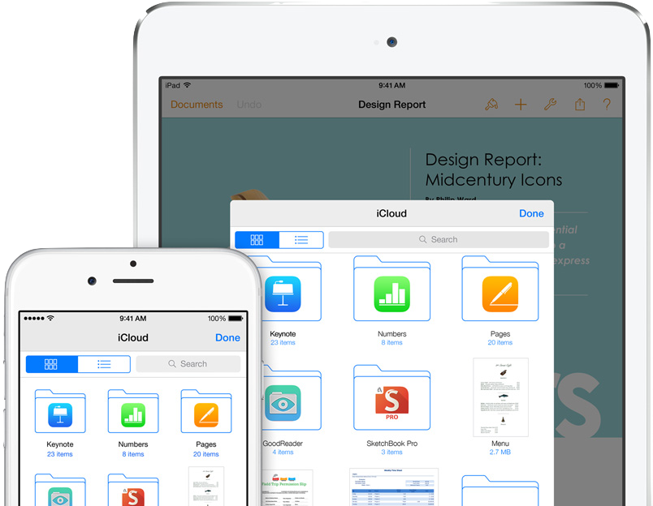



## CloudKit

When Steve Jobs unveiled iCloud to complement iOS 5 and OS X Lion at Apple’s annual Worldwide Developers Conference in 2012, the service was built on a legacy of abandoned platforms of similar intent and scope. Apple’s first foray into internet services was iTools in January 2000, which allowed Mac users to share digital e-cards, use their assigned @mac.com email addresses, and store files in their online “iDisk.” Next came .Mac (pronounced “dot-Mac”) in 2002, which synced contacts and calendars between Apple devices and steadily grew to encompass website hosting and media sharing—matching the company’s iLife application suite expanded in terms of both capabilities and marketing import.

Apple revamped their online services in 2008 to coincide with the introduction of iPhone 3G and the App Store with a new $99-per-year subscription service, called MobileMe. The new service encountered immediate obstacles beyond its price tag—combined with the simultaneous launch of iPhone OS 2.0, the brand-new App Store, and unprecedented activations of new iPhones, Apple’s servers buckled under the load. MobileMe members saw weeks of @mac.com or @me.com email downtime, famously motivating then-CEO Steve Jobs to publicly terminate the entire team responsible for the MobileMe rollout. So when Apple unveiled their latest iteration of a “cloud” offering with iCloud in 2011, developers reflected on the company’s past endeavors with apprehension. As Jobs himself put it, developers might ask, “Why should I believe them? They’re the ones who brought me MobileMe!”

The company’s iCloud introduction was twofold. On one hand, it offered many of the synchronization and online services for free to customers with iOS 5 or Mac OS X Lion. But on the other, it gifted developers an entire framework of cloud-assisted tools to work into their apps. Apps and games could store data on the cloud and have it automatically synchronize between Macs and iOS devices. Apps that use documents, like word processors and spreadsheet editors, could store files on iCloud and use OS X’s version history features between devices. While users could opt into additional iCloud storage, the service limited apps’ access to files within siloed-off app-specific directories. iCloud’s promise was compelling—a system for automatic file synchronization between devices, baked into two of the most popular operating systems in the world.

Steve Jobs introduces the first version of iCloud in 2011.

But iCloud fell short. Developers reported frustrations getting their apps to recognize content on the cloud, and users experienced problems with out-of-sequence synchronizations and overwritten data. These issues underscore the difficulty of developing a cloud platform to accommodate such uniquely massive demands, but left many third-party developers with sour tastes in their mouths regarding Apple’s first-party synchronization option. At this year’s conference, the company responded in a big way—they expanded and reimagined iCloud functionality to the benefit of both users and developers, offering entirely new ways for apps to interact with and take advantage of iCloud servers. CloudKit is more than a new way to store files, more than a new @icloud.com email address. Despite Apple’s many attempts at a unifying cloud storage-and-syncing solution, CloudKit represents a fresh start.

### When it rains, it pours

The “cloud” is a famously nebulous concept to many consumers, becoming something of a cultural touchstone for incomprehensibility and technological abstraction. The term’s origins are equally abstract—when big storage professionals began diagramming connections between on-site and off-site servers, they did so not with solid, fixed arrows but with squiggly lines, somewhat resembling the edges of puffy clouds. Put simply, the “cloud” as it applies to consumers refers to anywhere data can be stored that isn’t here—including a wide variety of online storage services and internet-assisted synchronization platforms. But to developers, the cloud solves problems related to limited on-device storage, taxing processor tasks, and complex synchronization between disparate platforms.

To wit, Apple is hardly the first company to offer comprehensive cloud backend services to developers. Google’s [Cloud Platform](https://cloud.google.com) provides cloud-assisted computation services, limitless storage, and querying tools that make sense of “big data.” Microsoft’s popular [Azure](https://azure.microsoft.com/en-us/) service offers virtual machines, databases, and mobile backends to developers across even iOS and Android platforms. And Amazon, too, provides [S3 cloud storage services](http://aws.amazon.com/s3/) to scaleably host and serve massive stores of data, including Netflix’s immense library of streaming video. While Apple’s developer cloud services certainly enter a crowded space, none of their competitor solutions can offer the level of seamless integration with iOS that Apple itself could—which is partly why previous initiatives were so eagerly awaited and so roundly disappointing.

> “I haven’t had a great experience with iCloud in the past,” said Punchkick iOS developer J.C. Subida. “The promise of iCloud was great, and I think CloudKit is going to deliver on that promise. I’m seeing that Apple has learned from their missteps with iCloud, and it seems like CloudKit is a much more refined version of what they originally envisioned.”

CloudKit looks to amend that, and the framework’s included capabilities put it ahead of those competitors in terms of depth and ease of integration with iOS apps. As the company bounces back from a frustrating developer experience with its previous cloud-assisted frameworks, the additions in iOS 8 only serve to strengthen Apple’s new magnanimous approach with developers. With CloudKit, Apple can not only bolster iOS’s position as one of the best mobile platforms to develop for, but also encourage some developers to code for iOS first—and solely.

### Cloud cover

CloudKit builds on existing frameworks for Core Data and iCloud synchronization, replacing many of those tools for both iOS 8 and OS X 10.10 going forward. [Billed by Apple](https://developer.apple.com/icloud/index.html) as a new way to “easily and securely store and efficiently retrieve your app data \[like structured data in a database or assets] right from iCloud,” the framework provides a prescribed method for transferring information between Apple’s servers and an app. Apple puts [basic caps](https://developer.apple.com/icloud/documentation/cloudkit-storage/) on the volume of data CloudKit apps can store and transfer, and the amounts scale with each new user. (If an app requires more than the maximum 1PB—or 1,000 TB—of asset storage, Apple encourages developers to contact them directly.)

![Screenshot of the livestream of an Apple developer conference keynote, with a slide showing the different responsibilities of “client side” and “server side” code in the CloudKit model, where the client side is responsble for “app client code” and the server side covers “app logic, authentication, asset storage, database storage, search, [and] notifications.” Presenter Craig Federighi shown in an inset.](../assets/cloudkit-keynote.jpg)

In addition, CloudKit provides for user authentication using their Apple ID and password, which allows customers to anonymously store their app data on Apple’s servers and have it magically appear across their iCloud-enabled devices. Similar to document storage in iOS 5 and 6, a simple toggle in the iOS Settings app enables or disables iCloud storage use across the operating system. 

> “Any apps that have to pass data around will benefit from CloudKit,” said Subida. “You could probably develop something as complex as a social networking app rather easily \[using] CloudKit. There’s no backend work, you don’t have to set up a server or a database—you just use CloudKit, and your data gets from device to device.”

With CloudKit, any and all app storage can exist outside of local device storage, allowing data-intensive apps to off-load their content and liberate storage space on 8or 16GB devices. And coming improvements to OS X Finder and the iOS document picker will allow CloudKit application data to coexist with custom user files in one, customer-facing directory. It’s the natural evolution of iTools’ iDisk, and will completely transform how users perceive and understand their “nebulous” cloud accounts going forward.

### The sky’s the limit

Compared to competitive solutions from Google, Microsoft, and others, CloudKit provides unparalleled storage and synchronization options for apps on iOS and OS X. This benefit might be attractive to new developers—as [Facebook tries](/facebook-forever#wearable-platform) to woo startups with its fbStart initiative and platform-agnostic Parse backend, and as [Google offers](http://9to5google.com/2014/09/12/google-is-giving-100k-in-google-cloud-platform-credit-to-startups-through-new-program/) $100,000 of cloud services credit to companies dipping their toes into its Cloud Platform, Apple might be uniquely positioned to help new apps get up and running on iOS. As Punchkick iOS engineer Sean Samocki points out, “it’s easier than ever for an indie developer to get going.”

> “With CloudKit,” Samocki continues, “it’s exciting that indie developers can spin up an app with a backend from Apple, without having to rely on \[Facebook’s] Parse or \[Amazon’s] S3. They provide a ton of project setup features. It could completely change the way startups approach mobile development.”

This exclusivity and ease of launch plays into Apple’s platform interests—by making it simpler to get started on iOS, developers might be encouraged to stick with Apple’s operating system long-term. “One downside is that if your app relies heavily on CloudKit, you’re kind of stuck on iOS,” said Samocki. “If I developed for both Android and iOS, I might have to think about alternative backend solutions for the same app.” Even so, CloudKit promises to make getting a project off the ground exponentially easier, meaning iOS customers will enjoy a new generation of cloud-assisted applications in coming months.

Despite its missteps over the last decade, Apple has hit its stride with CloudKit. The company’s internet service offerings have followed its unprecedented growth, and sometimes failed to keep up as iOS continued expanding. But the relative failure of .Mac and MobileMe were symptomatic of Apple’s spread-thin resources, not of the technologies themselves. In a way, the story of Apple’s constant cloud iteration mirrors the narrative of the company itself—routine reinvention brought on by evolving technological capabilities and expanding customer expectations. But the mobile giant is now prioritizing its relationship with developers, and has put its immense weight behind initiatives that make coding for iOS better and better. CloudKit isn’t some imperceptible developer feature that keeps the “cloud” ambiguous—CloudKit will make the cloud useful to consumers for the first time.
