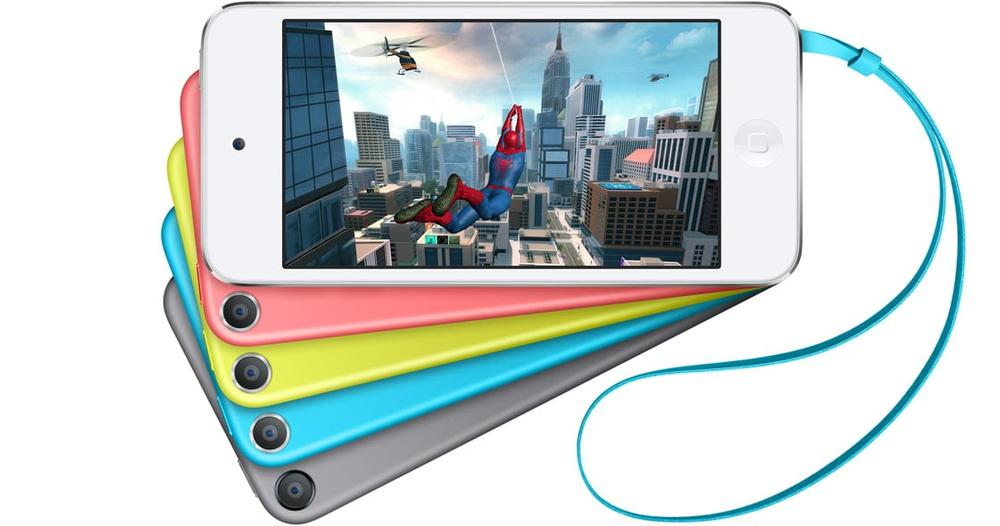
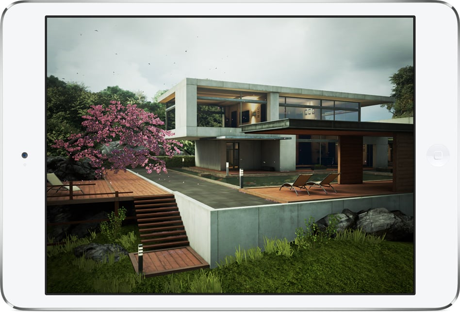
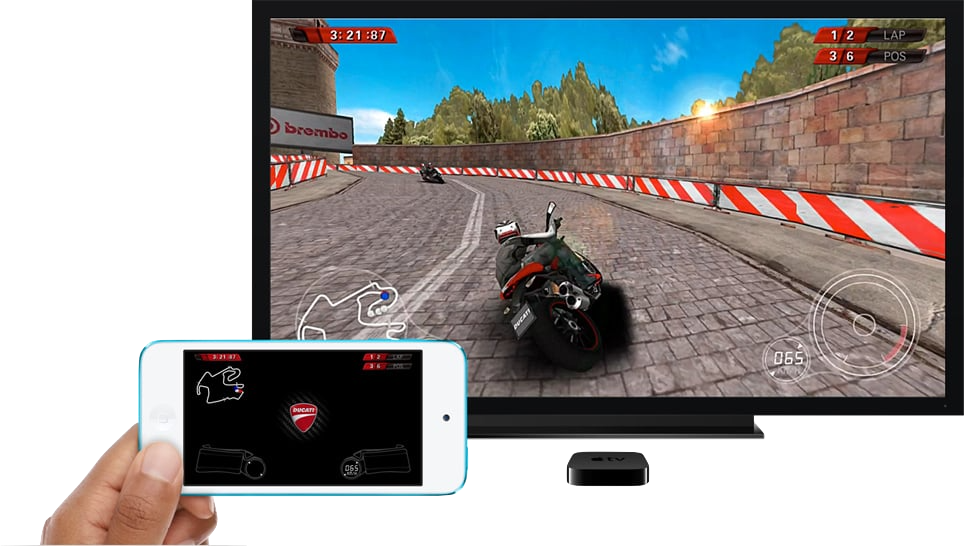
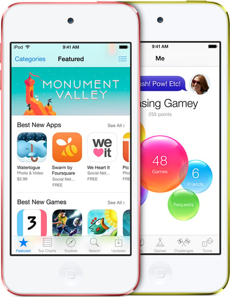



## SpriteKit, SceneKit, and Metal

Since the iOS App Store first debuted in 2008, developers have explored new ways to build beautiful, engaging, and addictive interactive games for the new mobile platform. Just as earlier smartphones featured basic brick-breakers—a mini-game Apple itself built into many iPods in 2005 and 2006—the iPhone offered an opportunity for developers to capitalize on users’ spare attention during commutes or lengthy meetings. Apple itself isn’t ignorant of its platform’s gaming opportunity—the company’s first app for the iPhone was actually a basic Texas Hold ‘Em simulator that featured computer-generated poker rivals and then-leading graphics. But [the category has exploded](http://www.punchkick.com/blog/2014/09/11/pay-to-play-how-mobile-games-capture-our-attention-for-99-cents) into one of the iOS App Store’s most popular and lucrative, and iOS games have been elevated to attract the attention of leading designers, artists, and storytellers.

Apple has invested heavily in iOS gaming since then, introducing powerful graphics processing units (GPUs) to their A-series systems-on-a-chip. The third-generation iPad, commonly referred to as “the new iPad” due to Apple’s short-sighted marketing copy, was powered by a revised version of the iPhone 4s A5 chip, called the Apple A5X. The A5X and its successor, the A6X in the fourth-generation iPad, included quad-core GPU components to drive the Retina display’s millions of additional pixels and enable a new class of tablet games. When the iPhone 5s debuted with its A7 system-on-a-chip in 2013, quad-core graphics processing had made it to the mobile form factor as well, obviating the need for an “A7X” chip in last year’s iPad Air or iPad mini with Retina Display. (Interestingly, Apple has yet to include quad-core graphics capabilities in its iPod touch lineup, despite touting the product as the quintessential mobile gaming companion.) To match its investments in device hardware, Apple has routinely featured iOS games at the front of the App Store, making the category one of the most popular and heavily-trafficked among the platform’s million-plus applications.

The business of building a video game involves effort from a wide range of disciplines, but the heavy lifting historically falls to software developers. Developers typically adopt one of many physics engines that define their game’s rules, including how gravity works within the game’s environments or how objects like characters and scenery interact with one another in physical space. These physics engines are assisted by programming interfaces (APIs) to relay instructions to the iOS device’s GPU, which helps compute the commands and display video game frames on the Retina display. Among the most popular of these APIs is OpenGL, or Open Graphics Library, which works across platforms and allows for rendering of 2D and 3D vector graphics. OpenGL runs on everything from iOS and [Android mobile phones](http://www.punchkick.com/blog/2013/07/24/google-introduces-android-4-3-jelly-bean) to desktop web browsers, but its approach is ripe for reinvention—although OpenGL has been actively developed and maintained since its initial release in 1992, certain common developer tasks are cumbersome and unintuitive.

> “I’ve explored OpenGL, but it’s a lot of work to even draw basic game elements,” said Punchkick iOS engineer [J.C. Subida](https://www.linkedin.com/in/jcsubida/). 

Alongside their introduction of [Swift](/ios-8-swift), an entirely new programming language to replace Objective-C in next-generation iOS and OS X applications, Apple introduced a number of new graphics APIs at WWDC 2014 to ease these development frustrations. “Apple made technologies that are like OpenGL, but that are much, much easier to learn and use,” said Subida. The company’s offerings for graphics development on iOS are threefold. First, iOS 7 introduced SpriteKit, a framework for easy development of animated 2D objects. Then, iOS 8 brought two more technologies into the fold—SceneKit, a framework inherited from OS X that assists with 3D graphics rendering, and the all-new Metal graphics API, which allows low-level access to iOS device GPUs to drive massive performance gains. “Apple gave developers another reason to try making an awesome game on iOS,” continued Subida. “Developers now have the tools to create some really cool things.” With these graphics technologies, building incredible games for iOS will no longer be crippled by development hurdles or capability limitations. SpriteKit, SceneKit, and Metal will power a new generation of mobile games that push the envelope of what iOS devices’ powerful GPUs can offer.

### SpriteKit

“Sprites” are the currency of 2D video games, dating back to the days of CRT arcade games like *Super Mario* and *Pac-Man*. A sprite is a two-dimensional texture applied to an object, like a character or enemy, that defines its physical boundaries and allows it to interact with other objects within an environment. As Mario bounces between floating platforms or Pac-Man consumes a fleeing ghost, their character models’ sprites are interacting with other sprites based on a predetermined set of physics rules. The specifics of implementation are more complex than this cursory explanation, but the fundamentals are sufficient to understand SpriteKit—which is why it’s so valuable to developers.

Games like <em>Super Mario World</em> rely on sprites for their characters and in-world objects.

SpriteKit is a graphics framework introduced in iOS 7, which allows for graphics rendering and 2D animation between sprites within iOS game environments. It uses graphics hardware on both Macs and iOS devices to composite 2D images at high frame rates—including textured rectangles (sprites), text, and even video. In short, SpriteKit makes it simpler to build 2D environments and interfaces using custom textures and shapes, allowing for more complex 2D graphics with minimal work, and translates those instructions for faster relay to the graphics hardware.

The framework is designed to accelerate the game development process for 2D video games, allowing game developers of any size to quickly mock up and develop game environments in vague with modern “retro” video game trends. More importantly, the accessibility of SpriteKit and its foundation on longstanding iOS development technologies will allow developers outside of gaming to more easily build 2D graphics elements into any kind of app, enabling [high-quality animations and transitions](http://www.punchkickinteractive.com/blog/2014/09/18/animation-unique-brand-story) in apps for social networking, photo editing, and any other iOS category. SpriteKit shouldn’t be pigeonholed for video game developers alone—robust 2D graphics frameworks could transform how interacting with any iOS app looks and feels in the future.

### SceneKit

Another massive addition to the iOS 8 graphics programming repertoire was inherited from the operating system’s older cousin, OS X. Like SpriteKit, SceneKit aims to tackle another headache for developers in the graphics arena: three-dimensional programming. The challenges for 3D graphics over 2D involve more than a z-axis—developers need to consider lighting effects, three-dimensional textures, and mechanics of motion for 3D objects through space. On Macs since OS X Mountain Lion, SceneKit has enabled dramatic 3D transitions like revolving bookshelves in iBooks or dialog windows that looked like rotating cubes. Now, on iPads and iPhones, SceneKit is poised to enable a new crop of three-dimensional interface elements and sophisticated 3D game environments.

> “3D programming is pretty hard,” said Punchkick iOS engineer [Chris Cieslak](https://github.com/cieslak), “It’s much different than 2D programming. SceneKit gives us an Objective-C or Swift wrapper around 3D programming—it’s a dead-simple way to drop 3D objects and lighting into complex environments with minimal effort.”

SceneKit gives developers a number of tools designed to make 3D game production quicker and easier, including a physics engine to define object motion through virtual space and a particle generator to create custom air effects and smoke for explosions. Coupled with SpriteKit, developers can take advantage of new lighting effects, per-pixel physics based on object shape, and collision detection to understand how objects within the game interact.

> “SpriteKit now interoperates with SceneKit, too,” said Cieslak. “It’s designed for developers with experience with Cocoa and UIKit. A lot of people will assume SpriteKit and SceneKit are for gaming only, but we can build 2D and 3D elements more quickly and efficiently into consumer apps, too, than we could with OpenGL. This makes 3D elements more possible in non-game applications, and it allows developers to make better use of these devices’ advanced graphics hardware.”

### Metal

Apple’s graphics offerings culminate in Metal, a new graphics API that brings iOS game app code as close to the GPU as possible to maximize performance. Unlike SpriteKit and SceneKit, which are targeted at developers making casual games, Metal is intended for hardcore games that need a lot of processing power—genres including shooters, simulation games, and racing games that require high-resolution graphics and handle hundreds or thousands of in-game objects and effects. iOS is already the de facto leader in hardcore mobile games, inheriting titles like *Madden NFL* and *Call of Duty* from game consoles and PCs. But Metal will push this further by offering iOS developers platform-specific graphics optimizations on mobile.

Today, iOS apps typically employ OpenGL to translate instructions into graphics commands that can be interpreted by the GPU and render objects in a scene. OpenGL sits between the app code and the GPU, and its volume of legacy code results in a huge degree of overhead. “Metal is like OpenGL, but with faster performance on iOS,” said Cieslak. Metal brings app developers near “bare-to-the-metal” access to the custom A7 and A8 chips’ GPUs, replacing OpenGL for many apps and allowing developers to more specifically focus iOS devices’ graphics power. The API allows for faster load times and more responsive games, but also simplifies once-complex graphics processes for developers.

> “I’ve never been interested in building games, but these announcements with graphics make me want to start,” said J.C. Subida. “Apple always emphasizes making things easier to do, and they’ve lowered the barrier to making a high-performance game with Metal.”

High-powered game developers already favor iOS for their latest titles, and Apple embraces the attention—with every keynote introduction of a new A-series system-on-a-chip, at least one game developer showcases its capabilities in fresh game. With Metal, the addition of complex lighting or thousands of in-air particles to game environments is less taxing on the A7 and A8 GPUs drawing them. Future iOS games will come even closer to console-quality, rivaling Xbox and PlayStation games in terms of graphics quality and environment complexity—next time iOS users lob a grenade in *Call of Duty* or watch confetti fall after they win the Superbowl in *Madden*, Metal could power the smoke and confetti particles as they drift through the air.

But, like SceneKit and SpriteKit, Metal’s importance extends far beyond video games. Graphics capabilities are relevant to a wide variety of popular iOS app categories outside of gaming—video editors, photo editors, and even audio editing software make use of the GPU to varying degrees. Rather than leaning on OpenGL to communicate tasks to the GPU, future multimedia app developers can leverage Metal to boost responsiveness and performance for graphics-intensive processes. The API doesn’t just shake up video games—it could usher in a new era of ultra-capable GPU-reliant applications for iPhones and iPads.

Like many of the other developer additions in iOS 8, the graphics improvements in SceneKit, SpriteKit, and Metal are intended not only to address today’s developer challenges, but also to transform the future of iOS development overall. To that end, certain advanced performance features won’t be available on older iPads and iPhones (including the 5c) predating the A7 and A8 systems-on-a-chip. But these features position Apple not only to attract the attention of high-end game developers looking to make a performance impact on mobile, but also first-time game developers who are exploring iOS for the first time.

Further, these technologies will extend beyond gaming and transform how iOS handles animations, motion, and interactivity within everyday applications on iOS. To say it “changes the game” would be an understatement—these changes will allow developers to better take advantage of iOS devices’ overpowered GPUs and build mobile products we couldn’t have imagined before. Gone are the days when quad-core GPUs were the exception—iOS 8 ensures that graphics will remain a first-class iOS citizen.
