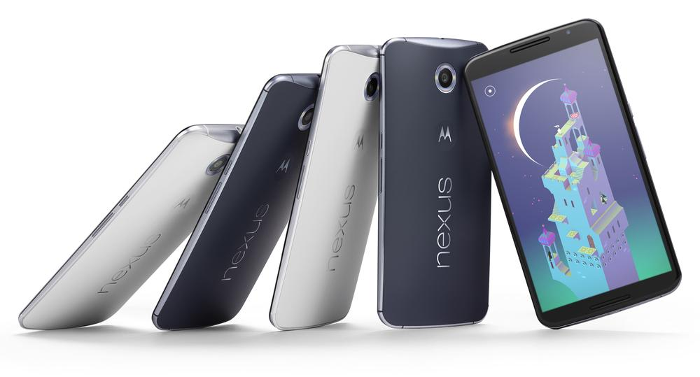
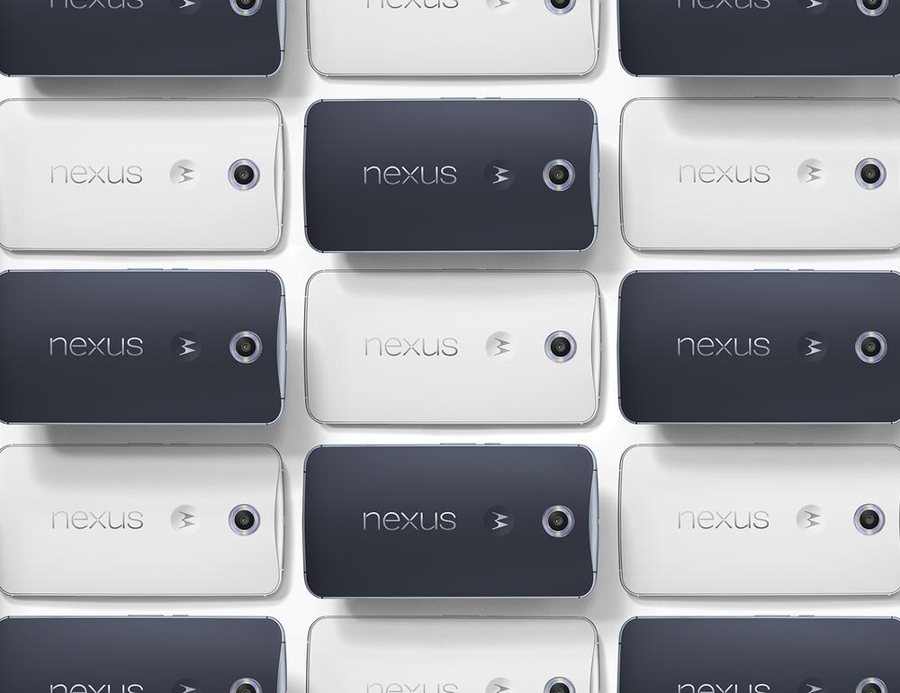
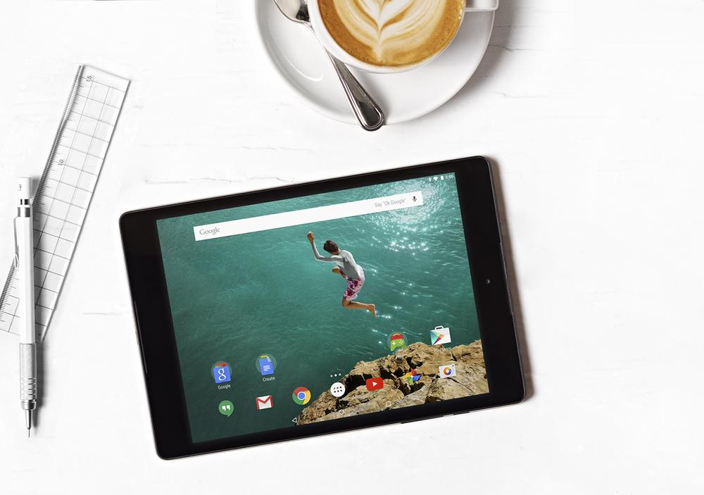
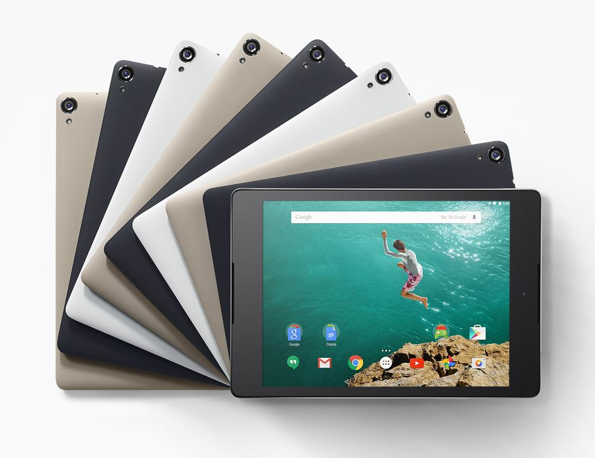
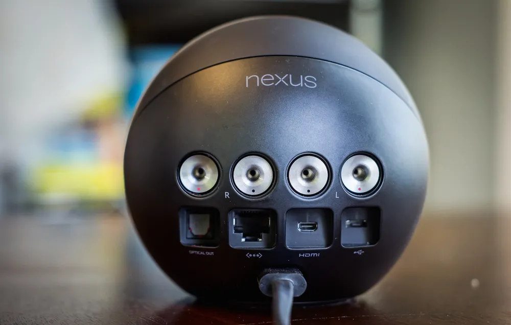
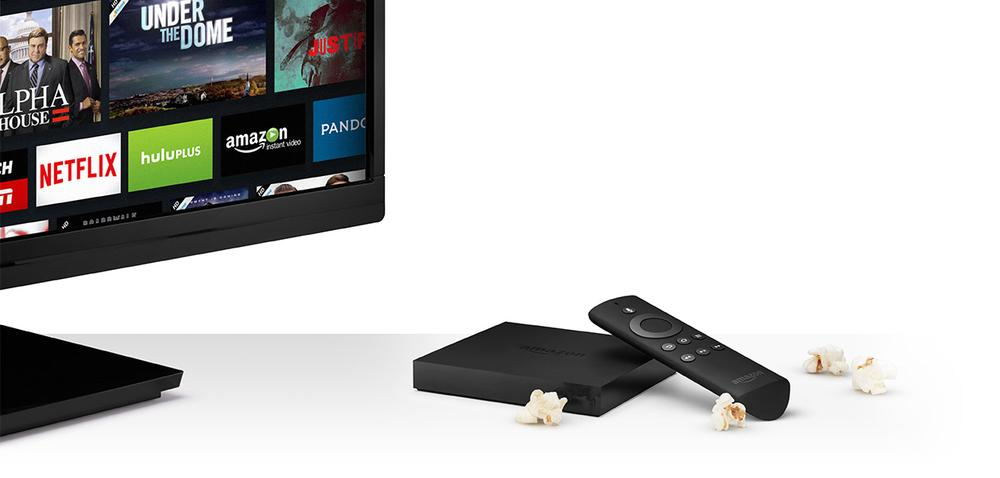
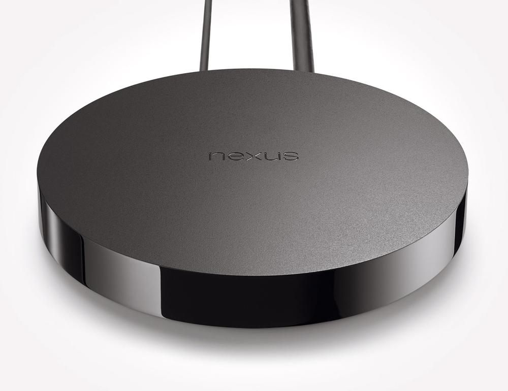

## Android’s New poster child {#nexus-6}

As Google began refocusing its software development efforts toward mobile, the search giant became increasingly invested in its Android operating system as a counterpoint to Apple’s meteoric iOS. Google worked hard to challenge Apple’s mobile operating system and innovate with exciting new features, to the point that many began to perceive Android as equal to, if not better than, iOS in terms of power and capability. But operating systems were only one mobile battleground—how could Google build hardware to beat the iPhone?

Google’s answer came in January 2010, as the company gathered media and developers together to unveil the first crown jewel in what would become a massive hardware initiative: the Nexus One. Cheekily named after the malevolent androids in Ridley Scott’s iconic *Blade Runner*, the Nexus One replaced HTC’s first Android handset as the standard-bearer for the platform. Google partnered with HTC as the Nexus One’s manufacturer, the first in a long history of hardware partnerships that facilitated all future Nexus hardware launches. Nexus One arrived with the freshly-minted Android 2.2 Froyo and set the precedent of software primacy for all future Nexus products to follow. Despite frustrating hangups with Android OEMs and carriers as new versions of Android crawled to widespread adoption, Nexus devices were always first to receive Android version updates as soon as they became available.

The Nexus One was followed in December 2010 by the Samsung-built Nexus S, which launched alongside Android 2.3 Gingerbread. Google subsequently released 3.0 Honeycomb for tablets, but the Nexus S still saw an update to 4.0 Ice Cream Sandwich in 2011, when the company launched another Samsung Nexus device, the Galaxy Nexus. Google raised the stakes for industrial design and hardware capability with the powerful LG-manufactured Nexus 4 and Nexus 5 in later years, showcasing the latest features of Android 4.2 Jellybean and 4.4 KitKat and packing a significant hardware wallop. But unlike many of the unremarkable smartphones from competitors, the Nexus series represents more than spec sheets and checked-off hardware boxes—Google aims to deliver the purest, cleanest Android experience possible on a mobile product.

The Nexus devices have always served as a product showcase for Google, boasting a stock Android interface free from manufacturer modification or developer augmentation. The design, feature set, and core user experience on Nexus devices are all as Google intended, drawing the admiration and devotion of many Android fans. Nexus devices have historically been first to take advantage of fresh Android capabilities, like Android Beam for proximity-aware sharing and Google Wallet NFC payment integration. No product more accurately represents Google’s mobile vision and its intentions for the future of Android, than the Nexus line—and no Android product more consistently raises the bar of quality for third-party Android manufacturers to strive for.

### Nexus 6

This morning, Google released a brief blog post announcing the introduction of three new Nexus devices and its latest version of Android, revealed at long last to be called Lollipop. Among the new products was the company’s new Nexus 6 handset, which replaced the longstanding Nexus 5 as Google’s vision for the purest Android mobile experience. Launching a [flashy website](http://www.google.com/nexus/6/) to showcase the new product, Google boasts its massive new offering as having “more room to explore.”

The marketing tagline is no hyperbole. The Nexus 6 delivers an enormous 6-inch display and curvaceous back panel mirroring Motorola’s Moto X from earlier this year. The parallels are no mistake—in keeping with Nexus manufacturing processes of years past, Motorola produced the Nexus 6 as a supercharged variant of its existing Moto X flagship offering, stretching the display an extra half-inch and stripping away Motorola’s minor software additions. Nexus 6 is the first smartphone to run Android 5.0 Lollipop, and eschews common Android interface tweaks espoused by third-party manufacturers since the platform’s inception.

The Nexus 6’s massive display is its primary attribute. With a quad-HD resolution matching the pixel density of many smaller handsets, the 6 offers an unparalleled canvas for enjoying images and videos on the go. With dual speakers inspired by HTC’s stereo investment in their One smartphone, the Nexus 6 is the perfect multimedia companion to Google’s growing library of Google Play Store movie and TV show content. With an impressive 13-megapixel rear shooter, an innovative ring-shaped LED flash borrowed from the Moto X, and Google Camera built in as Lollipop’s stock image capturer, the 6 might turn out to be the Android camera to beat.

Most exciting is Nexus 6’s “turbo charge” feature, leveraging faster battery technologies to accelerate recharge cycles and extend the device’s longevity. Between faster recharges, the 6 can last up to 24 hours on a single charge, dwarfing 10or 12-hour battery lives from competing Android and iOS devices. As smartphones become the connected hub of our mobile digital lives, powering Bluetooth-enabled wearable devices and an ever-growing number of connected accessories, a powerful battery to allow for this functionality will be critical.

The Nexus 6 signifies the formalization of Android’s “phablet” trend, as the platform’s steward itself embraces the increasingly popular form factor beyond 5 inches. The device’s size also positions Google interestingly versus Apple’s iPhone 6 Plus, extending a full half inch beyond what many iOS users already considered an enormous growth spurt. Google forecasts availability later this month, and the Nexus 6 will be offered from a variety of carrier partners, much like its predecessors, on the Google Play Store. Stay tuned for more updates on Google’s huge announcements, and for more analysis on the impact of Android Lollipop as the platform matures.

## Countering the iPad {#nexus-9}

After Apple introduced its iPad in 2010, many Android manufacturers began building tablets for Google’s platform to match it. Motorola released its ill-fated Xoom, Samsung pumped out early iterations of its still-thriving Galaxy Tab lineup, and even Amazon threw its hat into the ring with a forked version of Android running on its Kindle Fire. These attempts were wide-ranging and scattershot in their quality—manufacturers repurposed OS interface elements intended for 4 or 5 inches and stretched them to accommodate ever-expanding 10-inch displays. Google had to rein in the Android experience on tablets, and it took a cue from its early efforts with Nexus smartphones to do it.

First, the company got its software house in order. Android 3.0 Honeycomb arrived in 2011 with a revised interface for the tablet form factor exclusively. The version provided tablet-specific interface elements and brought the first incarnation of Android’s on-screen System Bar—the ubiquitous “back,” “home,” and “multitasking” icons that Android screens have gradually imported from physical buttons on smartphones. Honeycomb was quickly usurped by October 2011’s 4.0 Ice Cream Sandwich, which consolidated tablet and mobile Android versions under one chocolate-and-vanilla banner. But Google’s intentions with Android on tablets was clear, and their investment in the form factor was only beginning.

In early 2012, Google launched the Nexus 7, a smaller tablet designed to showcase the company’s new Google Play media offerings like games and magazines. The device’s low price point and impressive feature set helped it become one of the best-selling tablets that year, putting up adoption numbers to rival even Apple’s iPad 2 and third-generation “new iPad.” Nexus had grown beyond the smartphone, and now Google could deliver its optimized Android experience across form factors, inspiring a new generation of Android OEM tablet aspirants. In November of that same year, Google introduced its Nexus 10, a high-powered Android tablet more directly matching the dimensions of the platform’s Cupertino rival. When Apple announced the 7.9-inch iPad mini in October, the stage was set: both iOS and Android had flagship 7-inch and 10-inch tablets for customers to choose from, and their level of hardware quality and software polish made any choice a good one.

The Nexus products have long served as Google’s showcase for its vision of the future of Android, inspiring new ideas and perhaps imitation from its hardware partners shipping other Android flagships. The success of the first-generation Nexus 7 encouraged Google to introduce a slimmer second-generation model last year, further solidifying the company’s investment in Nexus tablets and bringing its hardware design language in line with its popular Nexus 5 handset. Since its introduction in 2012, however, the larger Nexus 10 tablet has remained largely unaltered—while it has received its share of Android updates well ahead of similar products from competitors, the tablet has maintained the same industrial design and hardware capabilities since its initial release with Android 4.2. This year, all of that is about to change.

### Nexus 9

Today, alongside the simultaneous announcements of its Nexus 6 handset and public availability of its next-generation Android Lollipop operating system, Google revamped its tablet offerings with an all-new Nexus 9 tablet. Replacing both last year’s Nexus 7 and the dated Nexus 10, the 9 boasts an HTC-manufactured soft-grip enclosure mirroring last year’s Nexus 5 design from LG. Coupled with an ultra-thin bezel and brushed metal accents, the tablet both honors and modernizes the Nexus brand’s design aesthetic from the past few years.

In addition to its sleek industrial design, the Nexus 9 features 802.11ac Wi-Fi and built-in quad-band GSM LTE capability, providing mind-numbing internet connectivity speeds wherever users take it. What’s more, the tablet’s 64-bit processor takes advantage of new advancements in Android Lollipop to offer increased performance and speed for even the most taxing of processor tasks, like multimedia and gaming. Like the Nexus 6, its dual stereo speakers offer an audio experience to match HTC’s One smartphones, delivering a high-fidelity and high-impact music and audio experience for the content Google’s expanding Play Store marketplace.

Google went all-in on the Nexus 9 tablet, replacing both its popular Nexus 7 and aging Nexus 10 products in one fell swoop. Unlike the company’s mobile lineup, which maintains the Nexus 5 as an entry-level option despite the brand-new and massive Nexus 6, Google fans seeking a stock Android user experience only have the 9 as their option. The tablet is no lightweight—its hardware specifications and camera capability put it at par or better than Apple’s existing iPad offerings—but third-party software availability for Android tablets remain a Google Play Store pain point.

Going into tomorrow’s [iPad announcements](http://www.punchkick.com/blog/2014/10/09/what-to-expect-at-apples-october-16-ipad-event) from Cupertino, Google has positioned itself strongly with an Android tablet experience that takes full advantage of the company’s evolving Lollipop ecosystem. As the search giant’s mobile operating system matures, and as Android hardware partners continue to iterate their tablet offerings, the Nexus 9 offers the best glimpse yet into Google’s vision for Android on a slate form factor. It remains to be seen if the public will embrace Google’s 9 as they did the 7, but their choices are clear: if you don’t want an iPad, there’s simply no purer Android experience out there.

## Targeting the living room {#nexus-player}

Beyond the smartphone, the average American customer interacts with a number of different screens over the course of their daily lives. They review documents and websites on their laptops, browse the web and play games on their tablets, and perhaps check notifications or health stats on their wearable devices. But no single screen has captured the populace’s attention like the one we replace least often: televisions. The TV has long been the primary avenue for culture distribution, unrivaled for decades until the advent of the internet. No two mediums have so completely dominated how customers receive their news, consume their favorite content, and interact with the cultural zeitgeist. For that reason, it should come as no surprise that major technology companies have begun developing products at the intersection of television and the web, with mixed results.

One of the earliest modes of content delivery in the living room were hard drive–based set-top boxes like cable providers’ DVRs and TiVos. These products allowed viewers to schedule downloads of their favorite programs to store for later consumption, and revolutionized the way we think about broadcast television. Whereas TV fans once had to set aside time to enjoy their favorite shows, they were now empowered to experience the content in their own time and on their own terms. This trend was accelerated by internet connectivity. Once Apple’s iTunes Store began selling TV content after the original air date, and once streaming media platforms like Netflix and Hulu began revolutionizing how syndicated video content is conceived and delivered, perceptions about TV viewership transformed completely. “Following” a show no longer meant staying in every Thursday night—viewers could catch up on a season’s worth of content over a single lazy Saturday.

Devices to assist with this new viewership model have been slow to market, but adoption trends have been promising. Apple’s first-generation Apple TV was conceptually a modernized TiVo, a hybrid of internet availability and hard disk storage on viewers’ media consoles. The Apple TV operated like an iPod with a 50-inch screen—it allowed users to download video content from iTunes via a tethered computer on their home Wi-Fi network, store it with an on-board hard disk, and play it directly from their at their leisure. The device was expensive, and cumbersome to set up, so Apple’s second-generation Apple TV flipped the script completely. It included zero on-board storage and streamed 100% of media directly from iTunes and streaming video partners like Netflix. The modern streaming box was born, and dozens of companies rushed to enter the space.

In 2014, the living room is an increasingly crowded technology sector. Roku has launched a half-dozen variants of its streaming boxes and gaming consoles like Xbox One and PlayStation 4 feature streaming video capabilities of their own. Televisions themselves even include some apps built in, with Samsung’s SmartTV offerings and LG’s repurposed webOS software leading the charge on televisions. But Google has yet to land a real hit in the set-top market, despite numerous attempts. Android TV and Nexus Player are its surest bet yet to capture the living room and capitalize on America’s true pastime.

### Jumping the shark

In 2010, Google unveiled their first take on what the future of entertainment boxes could look like. [Google TV](http://www.google.com/tv/) was a smart TV platform that could come preinstalled on partners’ televisions or operate from one of many connected set-top boxes. The software borrowed features from both Chrome and Android to offer unique apps, Google search, and web browsing on the big screen. Then–Google CEO Eric Schmidt promised widespread adoption by 2011, but the company’s plans failed to pan out: even goofy ad spots starring Kevin Bacon couldn’t help Google’s convoluted software catch on with consumers.

But Google didn’t give up there. Alongside its introduction of the Nexus 4 handset and Nexus 10 tablet at Google I/O 2012, the company teased a new set-top product called the Nexus Q. Running a variant of Android 4.0 Ice Cream Sandwich and enabling easy pairing with Android phones via NFC, the Q featured a truly jaw-dropping spherical design and a level of hardware polish unseen from Nexus products in the past. Unfortunately, it wasn’t to be: the Nexus Q’s $299 price tag and unclear market intention doomed the product before it had a chance to truly leave the starting gate. Google couldn’t win on TV by playing by other companies’ rules—so they retooled product design teams and set to work on something completely new.

### A bottle episode

Meanwhile, Apple’s secondand third-generation Apple TVs featured an iOS integration called AirPlay, which allowed content on iPhones or iPads to wirelessly play on connected televisions. Building on Apple’s AirTunes technology with iTunes and AirPort Express base stations, AirPlay expanded to include video streaming, audio streaming, and even display mirroring on connected Apple TVs over Wi-Fi networks. The platform seamlessness was quintessential Apple, and the integration features drove sales of the $99 set-top box more than anything else.

At the time, Google maintained two platforms, Chrome on laptops and desktops and Android on mobile and tablets. Most of the company’s seamlessness features were powered by robust backend cloud services, synchronizing messages and preferences across devices over users’ Google accounts. But the company sought to explore something totally new—something that bridged Chrome and Android and brought a level of fun to their living room experiences. In July 2012, Google quietly launched the $35 Chromecast, an HDMI dongle that allowed for wireless media steaming or mirroring via an Android app or Chrome extension. The low price of entry and ease of use helped Chromecast explode into one of the best-selling electronics products in recent years, and countless apps from media partners began supporting the “Google Cast” spec in Android and even iOS. Google had their hit, but needed something more.

### Shooting a pilot

Earlier in 2014, Amazon expanded their growing Fire line of products to include a set-top product called the Amazon Fire TV. Running a fork of Android called Fire OS, Amazon’s Kindle Fire tablets had been among the first non-iOS tablets to achieve a degree of success and adoption among casual tech consumers. With their addition of the Fire Phone and Fire TV, the e-commerce giant had a fully realized ecosystem to push their library of movies and TV content. Google’s Play Store now had a massive Android-based competitor, and the company needed to develop a way to deliver its media content directly to living rooms—fast.

Google’s current initiatives weren’t cutting it. The Chromecast allowed for Google Cast streaming of web content and mirroring of Chrome tabs, but didn’t have an interface of its own. Users couldn’t sit on the couch and simply use a Chromecast to explore media or stream movies. Alongside broad-ranging Android ecosystem announcements at this year’s Google I/O conference, Google introduced a new platform for televisions called Android TV. The software allowed users to browse and stream movies and TV shows from the Google Play Store, and actually ran Android applications on televisions—a pain point for the streaming hub Chromecast. Android TV launched with a development hardware box called the ADT-1, which would allow Android developers to begin adding support for Android TV to their apps. It represented the next generation of Google television products in their infancy—but it didn’t take long for Android TV to grow up.

### A series premiere

Alongside the company’s new Nexus 6 and Nexus 9, and to coincide with the launch of its long-awaited Android 5.0 Lollipop operating system, Google introduced the world’s first streaming set-top box running Android TV. Called the Nexus Player, the circular puck inherited industrial design cues from the Nexus Q and will retail for $99, in the range of Apple TV and Fire TV competitors. The Player is compatible with Lollipop devices and was designed to support existing Google Cast capabilities from Android apps and Chrome extensions, meaning early adopters could instantly begin streaming content from their existing devices.

The Nexus Player borrows voice search capabilities from Amazon’s Fire TV and offers a standalone video game controller for separate purchase, powering a fledgling ecosystem of Android-based console games. Coupled with playhead synchronization features to allow viewers to pick up where they left off on any of their connected Android devices, the Nexus Player occupies a desperately needed middle ground to pull Google’s media offerings closer together.

There’s no telling whether Nexus Player will see the widespread success of Chromecast or follow in the footsteps of its Google TV predecessors, but the new iteration fills a blind spot for Google Play’s up-and-coming media empire. As viewers’ expectations of streaming products and content availability continue to evolve, Nexus Player’s inclusion of quick voice search features and Android integrations could place it ahead of the pack. An interesting strategic decision means Google Cast works across mobile platforms, preventing the kind of OS lock-in that AirPlay brings to iOS. This means that any smartphone user, Android and iOS alike, could pick up a Nexus Player and begin exploring—now it’s up to Google Play to make them want to.
