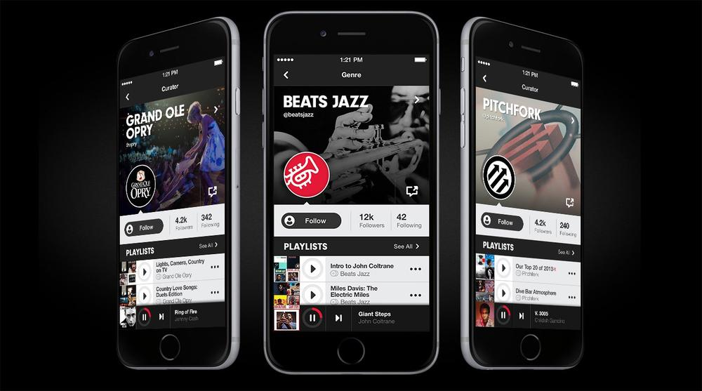
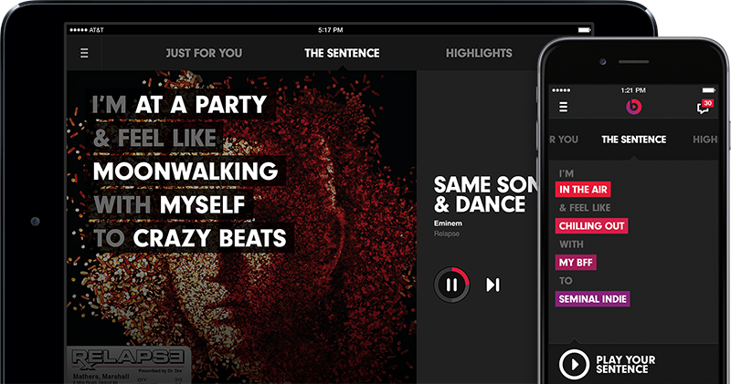

When digital music first entered the mainstream in the early 2000s, there were very few reputable and legal ways to download coveted MP3 files. Countless gray-area download services and file sharing communities sprouted up, not because of some malcontent or ill will toward the record industry, but because obtaining digital music legitimately was complicated and difficult. Apple sought to fill the void with its iTunes Store, and in so doing managed to upend the record industry forever. iTunes didn’t just distribute music: it offered new ways to discover and enjoy music across all of users’ digital devices. The service soon became the number one music retailer in the United States, besting brick-and-mortar CD sales from retail giants. But its days were numbered: as streaming advanced and companies began taking advantage of modern web technologies, iTunes lost its edge. As users’ expectations around music consumption shifted, the industry began to adopt a new perspective: the future of music is about providing *access* to content, not ownership. Despite its missteps, Apple is beginning to make plays that will ensure iTunes maintains its dominant position well into the future.

## iTunes is dead

As the iPod gobbled up the portable music player industry, much of its operation was dependent on an iTunes hub, feeding media and settings from a Mac or PC. The desktop software grew to encompass mobile device synchronization with iPhones and iPads, manage movies and TV shows, play podcasts, buy and synchronize iOS applications, and more. iTunes was bloated, and its time in the sun as the be-all–end-all solution to the challenges of digital music had lapsed. Apple’s product remained synonymous with music for millions of customers, but competitors were beginning to lap iTunes in terms of technical implementation and capability.

Among the first streaming solutions to achieve a degree of mainstream traction was Pandora, a web-based radio player that leant heavily on its “Music Genome Project” suggestion algorithms. The company released an iOS application that, for many, obviated the need for side-loaded audio content in their iOS Music app. Pandora was an example of what it would take for Apple fans to abandon iTunes: convenience, accessibility, and curation were key product attributes. But curated radio is more of a feature, not a product, and new disruptors were emerging to expand Pandora’s vision further.

In fact, Apple was among those companies most tuned into the future of music. The Cupertino giant acquired Lala in 2009, a website that allowed for limited streams of popular tracks. The technologies were eventually integrated into iTunes track previews in subsequent versions, but the company’s original intention was significant: allowing users to stream entire tracks, with limitations, over the web seemed like a futuristic and consumer-friendly offering. Apple recognized the potential, but dragged its feet in deploying a useful product.

> The future of music is access, not ownership.

In the mid-2000s, a small Swedish company took the next leap in democratizing music access. Spotify launched first in Europe, bringing millions of music fans direct access to a cloud library of thousands of albums. Its deals with record labels and artists helped drive prices down, allowing subscribers to stream unlimited plays from millions of tracks for as little as $10 a month. The approach was soon imitated by a number of smaller products, and user adoption spoke to its audience resonation: millions of people streamed or subscribed, boosting Spotify’s user base to more than 40 million listeners.

## Long live iTunes

Apple took note. Alongside iCloud in 2011, Apple debuted a new cloud-based music storage and synchronization service called iTunes Match. Modeled in part after Google’s Music Manager software, which allowed users to upload their MP3 collection to the cloud, iTunes Match enabled intelligent matching of users’ CD-sourced libraries to the iTunes Store’s collection of millions of tracks. (Any files that couldn’t be matched—say, your cousin’s demo tape—would be uploaded.) The files were then accessible from iOS devices and connected Macs or PCs running iTunes. Costing only $25 per year, Apple considered iTunes Match a sure bet against competition from smaller companies like Spotify, Rdio, and Google’s burgeoning interest in the space. Unfortunately for iTunes Match, users disagreed.

Apple needed a win to compete with Spotify, and to modernize its service to compete with the next wave of cloud-enabled streaming apps. The company’s answer was iTunes Radio alongside iOS 7, a product designed to encourage additional music downloads and propped up by advertisements. (Users could opt into a premium ad-free version as part of the $25 iTunes Match subscription.) Apple aimed for Spotify, but either its lack of knowledge[^1] or of focus yielded a product more rightfully aimed at Pandora. It became clear that, even if a music streaming service to rival Spotify could come from within Apple, it wasn’t going to happen in time.

Earlier this year, when Apple moved to acquire Beats Electronics—makers of pricey headphones and audio accessories—it also absorbed the company’s fledgling media streaming product, Beats Music. In truth, the purchase of the latter could have a more critical impact on the future trajectory of Apple’s cloud-enabled services. Beats Music was born of Beats’s acquisition of MOG, a popular music streaming website from the late 2000s. At the core of the Beats Music product is curation: a dedicated team of music experts hand-selected tracks to collate into genreor mood-specific playlists, which offered a level of professional suggestion uncommon among competitive streaming products. In addition, fun user interface flourishes like “the sentence”—which allows listeners to hear exactly the right music for when they’re “feeling like jamming” while “in the car” with “their in-laws”—gave Beats Music a personality and utility all its own.

> Beats Music is much more important to Apple than Beats headphones.

Beats Music maintains its identity separate from Apple, despite new versions for Apple TV and the inclusion among Apple-made apps on the iOS App Store. However, both rumors and common sense dictate that the Beats Music brand is on its way out, and that Apple will find better use for its technologies. The brands are eminently compatible: Beats’s music recommendation engine is reminiscent of iTunes Genius, which algorithmically determined complementary songs and arranged them into playlists. Both Beats chief Jimmy Iovine and Apple cloud services head Eddy Cue are legendary for their contract negotiation skills. And iTunes already boasts a high-visibility iTunes Radio brand, which could be expanded to accommodate Beats’s increased functionality. In fact, the speculation about Beats Music’s future might come to an end very, very soon.

In August, Beats Music CEO Ian Rogers inherited responsibility for the ad-supported iTunes Radio product, bringing the two streaming products closer together. Despite Apple representatives’ assurances that Beats Music is not being discontinued, clarity around its future as a standalone, independent service is hard to come by. It seems most likely that Beats will live on as a tangentially related iTunes variant, and will someday become entirely incorporated into iTunes Radio. The degree of cohesion is in question, but the intention is not: Apple believes Beats Music represents its best chance to bolster iTunes against Spotify and others, and will do whatever it takes to bring the service to as many iOS customers as possible. Someday, the house that Dr. Dre built might shelter more than colorful headphones—it might be the foundation for a new, improved, and updated iTunes.

[^1]: By some accounts, in a rare misstep by Apple, its executives simply didn’t understand what Spotify offered, and focused their attention on negotiating deals with record labels for a *radio* product, not a true *streaming* product. Apparently, they were too accustomed to the iTunes model as users themselves that they failed to recognize the benefits of a competitive solution that was overtaking them.
